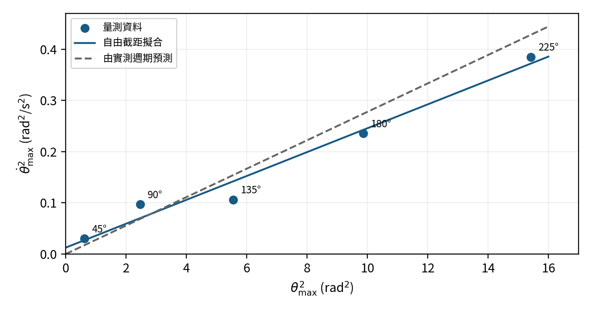
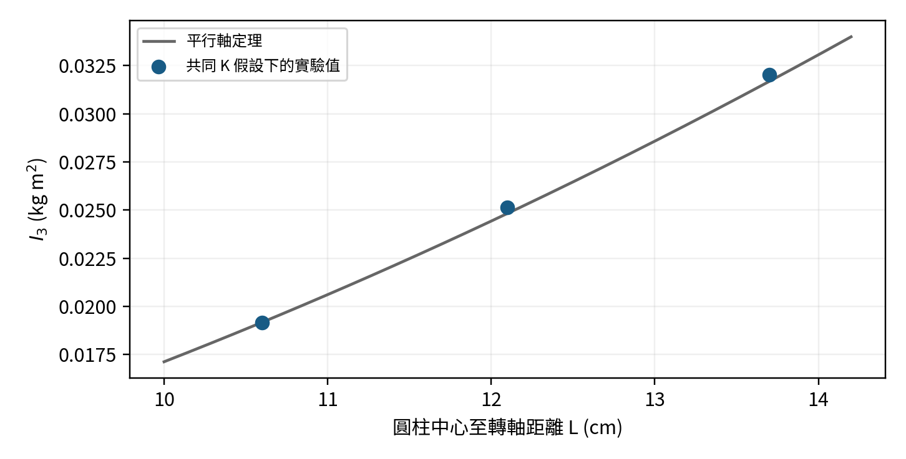

---
puppeteer:
  format: "A4"
  
  displayHeaderFooter: true
  headerTemplate: ' '
  footerTemplate: >
    

       / 
    

id: "test"
---

<!DOCTYPE html>
<html>
<head>
<meta charset="UTF-8">
<link rel="stylesheet" href="https://cdn.jsdelivr.net/npm/katex@0.16.9/dist/katex.min.css">

</head>
<body>
</body>
</html>

  

    普通物理學實驗
  

  

    扭擺與剛性係數
  

  

    組別：第四組
  

  

    組員： 
    4115064204 林致齊 
    4115064201 洪秉寬 
    4115064213 胡庭睿 
  

  

## 實驗目的

這次實驗希望用實際量到的時間，分清楚「扭得比較大」與「比較難轉動」對扭擺的影響。我們改變起始扭角，觀察平衡位置的角速度與週期，再利用已知圓盤作為校正物，推算圓環及圓柱的轉動慣量。最後由鋼絲尺寸求剛性係數，檢查量測結果是否合理，並找出最值得改善的測量環節。

## 實驗原理

### 扭轉回復力矩與簡諧運動

在鋼絲的線性彈性範圍內，扭轉角度越大，回復力矩越大，方向則朝向平衡位置。忽略阻尼時：

$$\tau=-K\theta=I\ddot\theta,\qquad T=2\pi\sqrt{I/K},\qquad \omega_0=\frac{2\pi}{T}\tag{1}$$

τ 為力矩（N·m），K 為扭轉常數（N·m/rad），θ 為相對平衡位置的角位移（rad），I 為系統對鋼絲軸的轉動慣量（kg·m²），T 為週期（s），ω₀ 為振盪角頻率（rad/s）。θ 上的一點及兩點分別表示對時間的一次與二次微分；ω₀ 與物體瞬間角速度 θ̇ 不同。

$$\frac12K\theta^2+\frac12I\dot\theta^2=E,\qquad \dot\theta_{\max}^2=\frac{K}{I}\,\theta_{\max}^2\tag{2}$$

E 為總機械能（J）；下標 max 表示最大值。最大扭角處動能為零，平衡位置的角速度最大，因此兩者平方應成正比。理論斜率為 K/I，也等於 4π²/T²。

### 由週期求轉動慣量

$$I_1=\frac{M_1r^2}{2},\qquad K=\frac{4\pi^2I_1}{T_1^2-T_0^2},\qquad I_0=\frac{T_0^2I_1}{T_1^2-T_0^2}\tag{3}$$

$$I_j=I_1\,\frac{T_j^2-T_0^2}{T_1^2-T_0^2}\ \ (j=2,3),\qquad I_{3,\mathrm{th}}=m_Ar_A^2+2m_AL^2\tag{4}$$

M₁、r 為圓盤質量與半徑；I₀、T₀ 對應空基座，I₁、T₁ 對應圓盤慣量及基座加圓盤的週期，I₂、T₂ 對應圓環，I₃、T₃ 對應兩圓柱。m_A、r_A 為單一圓柱質量及半徑，L 為圓柱中心至轉軸的距離。上述消去法要求各配置使用相同的 K。

### 由鋼絲尺寸求材料剛性係數

$$K=\frac{n\pi R^4}{2\ell},\qquad n=\frac{4\pi\ell M_1r^2}{R^4\,(T_1^2-T_0^2)}\tag{5}$$

n 為剪切模數／剛性係數（Pa），R 為鋼絲半徑（m），ℓ 為有效自由長度（m）。K 隨鋼絲尺寸改變，n 則描述材料性質。

## 實驗方法

實驗以鋼絲懸掛水平基座，透過光電閘量測遮光片通過平衡位置的時間。第一部分以起始扭角為自變量，保持基座及鋼絲配置不變，分別記錄五次遮光時間與兩週期總時間，檢查最大角速度及週期對扭角的反應。

第二部分以已知質量及半徑的圓盤校正扭擺，再改掛圓環、對稱放置兩個圓柱，並改變圓柱到轉軸的距離。每種配置記錄三次四週期總時間，利用週期平方差的比值消去空基座慣量與扭轉常數。第三部分以鋼絲半徑與有效長度，把量到的扭轉常數換成材料剛性係數。這個設計使同一組裝置可同時檢驗簡諧運動及平行軸定理。[1]

## 數據分析

### 尺寸與質量

| **項目** | **原始紀錄** | **計算用 SI 值** |
|---|---|---|
| 遮光片寬度 Δx | 1.12 cm | 0.0112 m |
| 光電閘到轉軸 d | 16.5 cm | 0.165 m |
| 圓盤 M₁ 與 r | 1.07 kg；9.26 cm | 1.07 kg；0.0926 m |
| 圓環 M₂ 與厚度 a | 3160 g；2.6 cm | 3.160 kg；0.026 m |
| 圓環外半徑 b 與內半徑 c | 9.39 cm；6.6 cm | 0.0939 m；0.066 m |
| 單一圓柱 m_A 與 r_A | 830 g；2.5146 cm | 0.830 kg；0.025146 m |
| 圓柱中心距離 L | 13.7；12.1；10.6 cm | 0.137；0.121；0.106 m |
| 鋼絲 R 與 ℓ | 0.0224 cm；159.8 cm | 0.000224 m；1.598 m |

光電閘距離改記為 d，避免和鋼絲半徑 R 混淆。圓環外半徑 b＝9.39 cm，內半徑 c＝6.6 cm，兩者均已確認為半徑。

### 第一部分原始遮光時間

| **θmax** | **第1次** | **第2次** | **第3次** | **第4次** | **第5次** | **總時間 t** |
|---|---|---|---|---|---|---|
| 225° | 107.0 | 109.0 | 109.0 | 110.0 | 112.0 | 75 s |
| 180° | 138.1 | 136.7 | 134.5 | 137.5 | 152.0 | 75 s |
| 135° | 210.9 | 191.3 | 193.5 | 219.2 | 226.6 | 75 s |
| 90° | 264.4 | 217.5 | 136.2 | 245.9 | 225.8 | 76 s |
| 45° | 424.9 | 430.7 | 462.9 | 303.7 | 343.6 | 76 s |

五次遮光時間單位均為 ms；右欄為兩個完整週期的總時間。135° 第二筆依原紀錄確認為 191.3 ms。45° 五筆平均重算為 393.16 ms，原手寫平均 393.22 ms 不沿用。全部原始測值保留。

計算先保留完整位數，表內多列小數供核對；這不代表測量具備相同精度。五組空基座週期依序為 37.5、37.5、37.5、38.0、38.0 s，平均 T₀＝37.70 s。

### 第一部分角速度與週期分析

$$\dot\theta_{\max}\approx\frac{\Delta x}{d\,\overline{\Delta t}},\qquad \dot\theta_{225}=\frac{1.12/16.5}{109.40\times10^{-3}}=0.620464\ \mathrm{rad/s}$$

Δt̄ 為五次遮光時間的算術平均，d 為光電閘到轉軸的距離。依紀錄表以平均時間估算通過平衡位置的角速度；它是有限遮光區間的速度近似值。

| **角度** | **Δt̄（ms）** | **sΔt（ms）** | **θ̇max（rad/s）** | **θmax²（rad²）** | **θ̇max²（rad²/s²）** |
|---|---|---|---|---|---|
| 225° | 109.40 | 1.82 | 0.620464 | 15.421257 | 0.384976 |
| 180° | 139.76 | 6.98 | 0.485681 | 9.869604 | 0.235886 |
| 135° | 208.30 | 15.56 | 0.325870 | 5.551652 | 0.106191 |
| 90° | 217.96 | 49.20 | 0.311428 | 2.467401 | 0.096987 |
| 45° | 393.16 | 66.60 | 0.172649 | 0.616850 | 0.029808 |

sΔt 為五筆讀值的樣本標準差，僅用來描述分散程度。連續擺動中的讀值可能受阻尼影響，不能直接視作五次獨立實驗的測量不確定度。角度先轉成 rad 再平方。

<figure class="image-block">
  

  <figcaption>圖1 最大角速度平方與最大扭角平方。實線為未強制通過原點的最小平方法；虛線由 T₀＝37.70 s 預測。</figcaption>
</figure>

$$y=0.02331892\,x+0.01254259,\qquad R^2_{\mathrm{fit}}=0.972045,\qquad T_{\mathrm{fit}}=\frac{2\pi}{\sqrt{0.02331892}}=41.1458\ \mathrm{s}$$

以實測平均週期為分母，差異為 |41.1458−37.70|／37.70×100%＝9.14%。若依理論限制截距為零，斜率為 0.02446124 s⁻²，週期為 40.1736 s，差異為 6.56%。主結果使用自由截距擬合，兩種結果均列出，不以誤差較小作為選模依據。

225° 到 45° 的週期僅介於 37.5～38.0 s，未見扭角愈大、週期愈長的趨勢，與理想扭擺的振幅獨立性大致相符；但秒級總時間紀錄不足以排除小幅差異。

### 第二部分各配置的週期

| **配置** | **第1次四週期（s）** | **第2次四週期（s）** | **第3次四週期（s）** | **平均週期（s）** |
|---|---|---|---|---|
| 圓盤 | 171.3296 | 171.8213 | 171.3992 | 42.879175 |
| 圓環 | 195.1355 | 195.1035 | 194.7102 | 48.745767 |
| 圓柱 13.7 cm | 263.3376 | 263.7469 | 262.9921 | 65.839717 |
| 圓柱 12.1 cm | 243.6630 | 243.5091 | 243.5535 | 60.893800 |
| 圓柱 10.6 cm | 225.3057 | 224.9290 | 224.7146 | 56.245775 |

| **配置** | **第1次週期（s）** | **第2次週期（s）** | **第3次週期（s）** |
|---|---|---|---|
| 圓盤 | 42.832400 | 42.955325 | 42.849800 |
| 圓環 | 48.783875 | 48.775875 | 48.677550 |
| 圓柱 13.7 cm | 65.834400 | 65.936725 | 65.748025 |
| 圓柱 12.1 cm | 60.915750 | 60.877275 | 60.888375 |
| 圓柱 10.6 cm | 56.326425 | 56.232250 | 56.178650 |

原紀錄中圓柱欄雖印成「週期」，實際填入四週期總時間，因此三欄一律除以 4。以 13.7 cm 組為例，平均總時間為 263.3588667 s，平均週期為 65.8397167 s。

### 校正與計算示例

圓盤 I₁＝1.07×0.0926²／2＝0.0045874966 kg·m²。以 T₀＝37.70 s、T₁＝42.879175 s 得到 K＝4.33962×10⁻⁴ N·m/rad，I₀＝0.0156234 kg·m²。圓環計算如下：

$$I_2=0.0045874966\times\frac{48.7457667^2-37.70^2}{42.879175^2-37.70^2}=0.0104961964\ \mathrm{kg\,m^2}$$

$$I_{2,\mathrm{th}}=M_2\left(\frac{b^2+c^2}{4}+\frac{a^2}{12}\right)=0.0105848492\ \mathrm{kg\,m^2}$$

兩圓柱的實驗值使用相同週期平方差公式。理論值使用 I₃＝m_A r_A²＋2m_A L²，例如 L＝0.137 m 時，I₃,th＝0.830×0.025146²＋2×0.830×0.137²＝0.03168137 kg·m²。

| **物體** | **I實驗（kg·m²）** | **I理論（kg·m²）** | **相對差異** |
|---|---|---|---|
| 圓環 | 0.01049620 | 0.01058485 | 0.84% |
| 兩圓柱 13.7 cm | 0.03202721 | 0.03168137 | 1.09% |
| 兩圓柱 12.1 cm | 0.02513702 | 0.02482889 | 1.24% |
| 兩圓柱 10.6 cm | 0.01915202 | 0.01917659 | 0.13% |

相對差異＝|I實驗−I理論|／I理論×100%。圓環使用已確認的內、外半徑代入講義式（13）；所有實驗值暫以共同 K 分析，重綁鋼絲對後兩組圓柱結果的影響見下一頁。

### 圓柱位置與轉動慣量的關係

<figure class="image-block">
  

  <figcaption>圖2 兩圓柱轉動慣量與中心距離。曲線直接取平行軸定理的理論式，並非用三點硬套二次曲線。</figcaption>
</figure>

圓柱中心距離由 10.6 cm 增至 13.7 cm 時，計算出的轉動慣量由 0.0191520 增至 0.0320272 kg·m²。方向與 I₃＝m_A r_A²＋2m_A L² 一致。理論式中的 L² 表示距離增加的影響會逐漸變大，不能把 I₃ 與 L 的關係說成正比。只有三種距離，也不足以單靠曲線外觀完整驗證平方關係。

### 圓環轉動慣量的比較

本次確認圓環外半徑 b＝9.39 cm、內半徑 c＝6.6 cm，因此可直接代入講義式（13）。所得理論轉動慣量為 0.01058485 kg·m²，實驗值為 0.01049620 kg·m²，實驗值比理論值低約 0.84%，兩者相當接近。這支持以週期平方差估算轉動慣量的方法，但仍須留意圓環的固定位置、尺寸量測及週期讀值所造成的影響。

### 鋼絲重綁與共同校正條件

操作過程曾在圓柱第一組完成、第二組開始時發生鋼絲斷裂並重綁。鋼絲有效長度若改變，K 也會改變，重綁前量到的 T₀ 與 T₁ 便不能無條件沿用到後兩組。現有紀錄沒有重綁前後各自的有效長度及空基座、加圓盤週期，所以表中後兩組只是共同 K 假設下的估算。

重綁若使鋼絲縮短，因 K＝nπR⁴／(2ℓ)，K 會增大、相同配置的週期會縮短；此時仍用舊的 K 換算，可能低估後測物體的轉動慣量。距離變小與鋼絲變短都可能讓週期下降，現有資料無法把兩者分開。後兩組與理論接近，不足以單獨證明系統誤差已被消除。

### 第三部分鋼絲剛性係數

$$n=\frac{4\pi(1.598)(1.07)(0.0926)^2}{(0.000224)^4\,(42.879175^2-37.70^2)}=1.753544996\times10^{11}\ \mathrm{Pa}$$

依本次尺寸紀錄及共同校正結果，n 約為 1.75×10¹¹ Pa，即 175 GPa。鋼絲直徑換算為 0.448 mm；這是由紀錄半徑換算，並非另一次量測。

OpenStax《University Physics Volume 1》第12.3節表12.1列出的鋼材剪切模數約為 7.5×10¹⁰ Pa。[2] 以此作一般鋼材參考，相對偏差＝|1.753545×10¹¹−7.5×10¹⁰|／(7.5×10¹⁰)×100%＝133.81%。這是對教科書近似參考值的比較，並非對這條未知牌號鋼絲的認證值誤差。不能把楊氏係數或體積彈性模數拿來作本實驗的參考值。

### 第三部分剛性係數的敏感度與誤差來源

$$\frac{\delta n}{n}\simeq\frac{\delta\ell}{\ell}+\frac{\delta M_1}{M_1}+2\frac{\delta r}{r}-4\frac{\delta R}{R}-\frac{2T_1\delta T_1-2T_0\delta T_0}{T_1^2-T_0^2}$$

δ 表示小幅輸入改變；上式用來判斷敏感度與偏差方向，並不是已完成的不確定度預算。半徑低估 1% 會使 n 約高估 4%；ℓ 高估 1% 則使 n 約高估 1%。本次未保留五個位置的鋼絲讀值、量具解析度及零點修正，無法據此認定半徑就是唯一誤差來源。

以目前其他量固定估算，若要得到 75 GPa，半徑需約為 0.277 mm，而紀錄值為 0.224 mm；這相當於約 24% 的差距，已不是小小的四捨五入差異。此反算只是檢查量級，不能拿來取代原測值。應優先核對直徑是否確實除以 2、螺旋測微器零點、不同位置的線徑，以及 159.8 cm 是否為夾持點之間真正參與扭轉的長度。

T₀ 取 37.5 s 時，n 約為 169 GPa；改用五組平均 37.70 s 時為 175 GPa。可見 T₀ 的處理確實影響結果，但這個差異不足以解釋與 75 GPa 參考值的落差。鋼絲長度紀錄若來自重綁後，卻搭配重綁前校正得到的 K，也會使材料參數的計算條件不一致。

### 第一部分數據品質的檢查

90° 組遮光時間標準差為 49.20 ms，約占平均的 22.57%；45° 組為 66.60 ms，占 16.94%，高於 225° 組的 1.66%。90° 中 136.2 ms 的讀值特別短，且讀值次序並非單純逐次增加，所以不能只用阻尼造成振幅下降解釋所有分散。光電閘未對準平衡位置、基座伴隨左右晃動、遮光片斜向通過或紀錄讀值的問題，都值得在重測時逐一檢查。目前沒有足夠證據刪除任何一筆。

圖1的 R²＝0.972 代表線性趨勢明顯，不等於能量完全守恆或儀器準確。正截距與9.14%的週期差異，仍顯示模型、量測及平均方法之間存在偏離。

## 結果與討論

### 改善方法與延伸應用

#### 優先改善的量測

第一，鋼絲更換或重綁後重新量空基座與加圓盤週期，並記錄夾持點間長度。這能避免把裝置改變誤認為物體轉動慣量改變。

第二，保留量具與量測位置的照片，清楚標示各項尺寸，並在鋼絲至少五處量直徑、記錄原始讀值及零點修正，再除以2取半徑。

第三，先讓基座的左右晃動停止，再讓遮光片中心沿同一路徑穿過光電閘。每個起始角度重新釋放數次，量測相同位置的通過事件；若用同方向通過事件相減，就可直接得到完整週期。延長至多個週期再平均，可降低人工啟停或秒級取值對單一週期的影響。

#### 替代方法與適用情況

可在基座加上標記，使用固定鏡頭錄影追蹤角度隨時間的變化，再擬合有阻尼的振盪曲線。這能同時觀察週期、振幅衰減與非扭轉晃動，代價是必須校正鏡頭視角與影片幀率。若只需更可靠的 K，也可增加數個已知慣量，在同一鋼絲條件下畫 T² 對附加慣量圖，由斜率4π²/K求K，比只用兩個配置更容易發現異常點。

#### 延伸應用

扭擺量測可延伸至不規則零件的慣量估測，協助分析馬達啟停、控制系統加減速與旋轉機構負載；已知物體慣量後，也能反過來比較不同線材的扭轉剛度。實際應用時須把夾具慣量、阻尼與軸的位置納入校正。

## 結論

空基座在五種扭角下的平均週期為37.70 s，週期未隨扭角出現明顯單調變化。最大角速度平方與扭角平方呈近似線性，擬合反推週期為41.15 s，與實測相差9.14%，因此資料支持理論趨勢，但仍有可觀偏離。

在共同K的計算條件下，圓環與圓柱轉動慣量相對理論差異為0.13%～1.24%；其中圓柱後兩組受重綁鋼絲條件不明限制，不能只憑小差異認定驗證精確。剛性係數約175 GPa，相對一般鋼材75 GPa參考值偏高約134%，未能得到可靠的材料參數。本次最重要的改進，是把幾何定義、線徑原始讀值與每次鋼絲校正完整記錄。

## 參考資料

1. 課程講義〈實驗六 扭擺與剛性係數〉，頁6-1至6-10；作者、版次、出版單位與年份未標示。另參照課程〈實驗報告格式〉兩頁投影片及本組三頁量測紀錄。

2. Samuel J. Ling, Jeff Sanny, William Moebs. University Physics Volume 1. OpenStax, Rice University（Houston, Texas, USA）, 2016。線上版未標版次，第1冊，第12.3節 Stress, Strain, and Elastic Modulus，表12.1。HTML版無固定頁碼，查閱日期2026-09-28。

https://openstax.org/books/university-physics-volume-1/pages/12-3-stress-strain-and-elastic-modulus

3. 同[2]，第10.5節 Calculating Moments of Inertia，式10.19、10.20及圓盤積分推導。HTML版無固定頁碼，查閱日期2026-09-28。

https://openstax.org/books/university-physics-volume-1/pages/10-5-calculating-moments-of-inertia

## 工作分配

| 組員 | 學號 | 負責工作 |
|:---:|:---:|:---|
| 洪秉寬 | 4115064201 | |
| 胡庭睿 | 4115064213 | |
| 林致齊 | 4115064204 | |