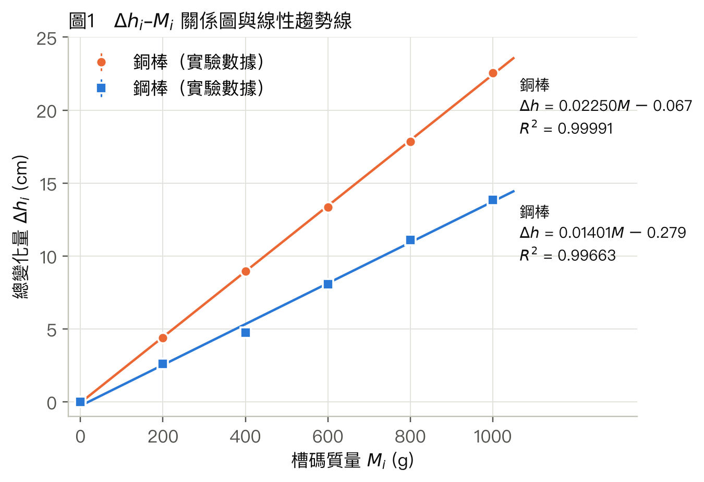
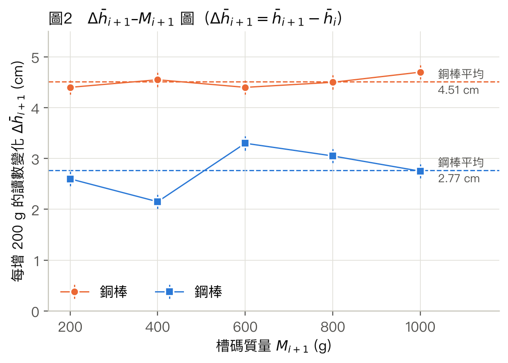
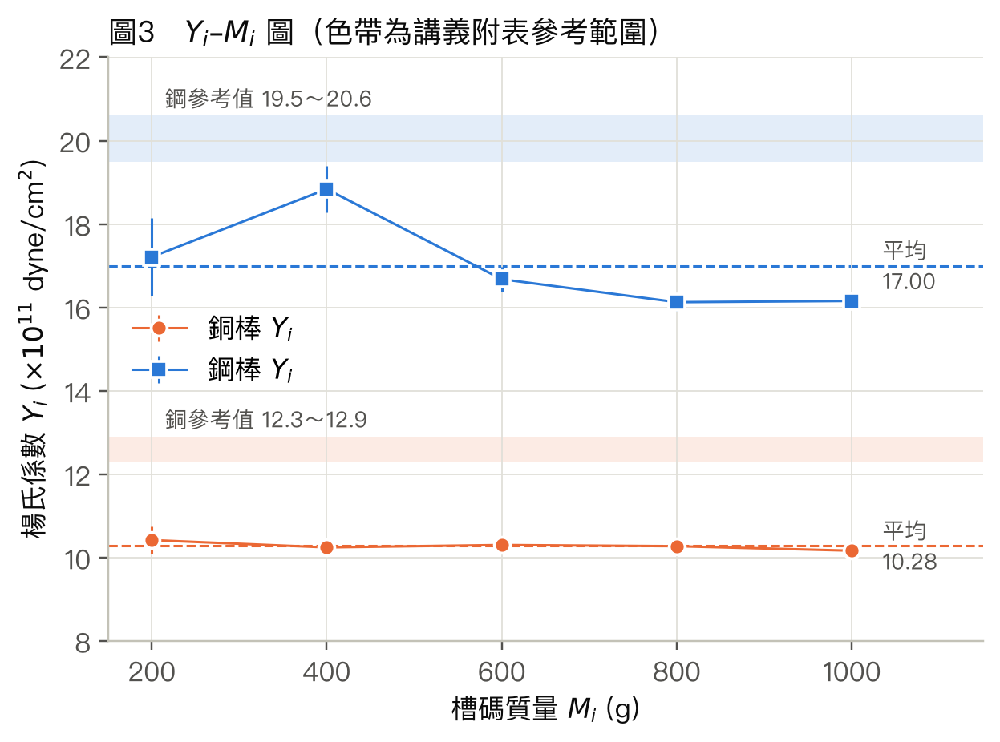
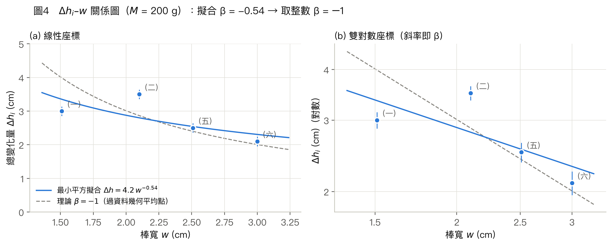
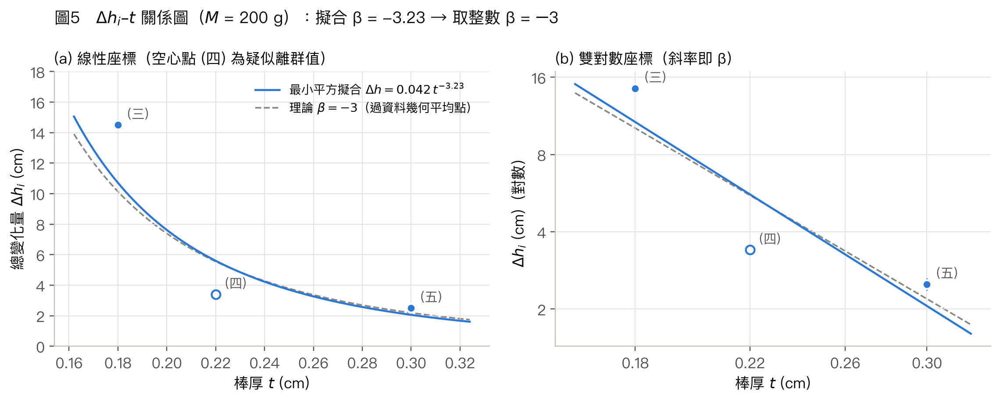

---
puppeteer:
  format: "A4"
  
  displayHeaderFooter: true
  headerTemplate: ' '
  footerTemplate: >
    

       / 
    

id: "test"
---

<!DOCTYPE html>
<html>
<head>
<meta charset="UTF-8">
<link rel="stylesheet" href="https://cdn.jsdelivr.net/npm/katex@0.16.9/dist/katex.min.css">

</head>
<body>
</body>
</html>

  

    普通物理學實驗
  

  

    楊氏係數測定
  

  

    組別：第4組
  

  

    組員： 
    4115064204 林致齊 
    4115064201 洪秉寬 
    4115064213 胡庭睿 
  

  

## 實驗目的

因為金屬棒彎曲的位移極小，希望透過這次實驗，我們可以學會利用光槓桿原理，將位移放大到能透過望遠鏡讀取米尺刻度，並從實驗得出的數據求出銅和鋼的楊氏係數，了解不同材質的金屬棒掛槽碼後的形變程度。另外，我們也想用不同寬度、厚度的鋼棒，實際確認彎曲量和$w$、$t$ 的關係是否如公式所說的是 $w^{-1}$ 和 $t^{-3}$，並從實驗結果和理論值的差異中思考量測方法、材料尺寸與操作過程可能造成的實驗誤差，並進一步思考改進方法，從錯誤中學習，以求下次做實驗能夠更精準。

## 實驗原理

### 1. 應力、應變與楊氏係數

彈性體受一對大小相等、方向相反的力時會變形。應力是單位面積受的力，應變是長度的相對變化。在彈性限度內兩者成正比：

$$\frac{F}{A}=Y\cdot\frac{\Delta L}{L}\tag{1}$$

其中 $F$ 為作用力，$A$ 為受力面積，$L$ 為原長，$\Delta L$ 為長度變化量，比例常數 $Y$ 即楊氏係數，只和材料有關，單位為 $\frac{dyne}{cm^2}$。

### 2. 受力橫樑的彎曲

橫樑架在相距 $L$ 的兩個支點（刀口）上，中點受鉛直力 $G$ 而往下彎。彎曲時上層被壓短、下層被拉長，中間有一層長度不變，稱為中性層。

由力矩平衡分析彎曲樑各部分的受力（推導見講義附錄），可得中點下降量 $H$ 與楊氏係數 $Y$ 的關係：

$$H=\frac14\left(\frac{L}{t}\right)^3\frac{1}{w}\cdot\frac{G}{Y}\tag{2}$$

| 符號 | 意義 |
|:---:|:---|
| $H$ | 橫樑中點的下降量 |
| $G$ | 中點所受鉛直力，$G=Mg$（$M$ 為中點所掛的質量） |
| $L$ | 兩刀口間距離 |
| $w,\ t$ | 棒寬、棒厚 |
| $Y$ | 楊氏係數 |

由式 (2)，$H\propto w^{-1}$、$H\propto t^{-3}$，所以棒厚對彎曲量的影響比棒寬大很多。

### 3. 光槓桿

光槓桿是裝在三腳架上的平面鏡，兩前腳放在固定的支撐條上，後腳放在待測棒中點。棒中點下降 $H$ 時，鏡面後傾 $\theta$，反射光轉 $2\theta$，望遠鏡中米尺刻度移動 $\Delta h$：

$$\frac{H}{a}=\sin\theta\approx\theta,\qquad \frac{\Delta h}{d}=\tan2\theta\approx2\theta\quad\Longrightarrow\quad H=\frac{a\,\Delta h}{2d}\tag{3}$$

$a$ 為後腳到兩前腳連線的垂直距離，$d$ 為鏡面到米尺的距離，$\Delta h$ 為米尺刻度的變化量。放大倍率 $\Delta h/H=2d/a$，本實驗 $d=150$ cm、$a=2.4$ cm，放大了 125 倍。

以上推導（式 2、式 3）的假設條件有：
* 兩刀口之間的距離 ($L$) 需遠大於彎曲程度 ($H$)、棒寬 ($w$) 與棒厚 ($t$)
* 金屬棒受力不超過彈性限度
* 彎曲時上層收縮、下層伸張，中間一定有一層保有原本長度的**中性層**
* 材料均勻，$Y$ 處處相同，橫截面是均勻的矩形
* 傾斜的角度 $\theta$ 極小，式 (3) 的三角函數近似才成立

### 4. 楊氏係數的計算

式 (3) 代入式 (2)，令 $G=Mg$：

$$Y=\frac{MgL^3d}{2wt^3a\,\Delta h}\tag{4}$$

其中 $g$ 為重力加速度（本實驗取 $980\ \text{cm/s}^2$），$M$ 為相對於未加槽碼時所增加的質量（勾盤質量在 $\Delta h$ 中已抵銷），其餘符號同前。

表 1、表 2 中的 $Y_i$ 是把 $M_i$ 和總變化量 $\Delta h_i=\bar h_i-\bar h_0$ 代入式 (4)。表 3 則用相鄰兩次讀數的差：

$$\Delta\bar h_{i+1}=\bar h_{i+1}-\bar h_i,\qquad Y_i'=\frac{\Delta M\,gL^3d}{2wt^3a\,\Delta\bar h_{i+1}},\quad \Delta M=200\ \text{g}\tag{5}$$

依式 (4)，$\Delta h$ 與 $M$ 成正比。把數據畫成直線 $\Delta h=kM+b$，由斜率 $k$ 得

$$Y=\frac{gL^3d}{2wt^3a\,k}\tag{6}$$

不同寬度、厚度的鋼棒實驗（數據分析第五節）固定 $M$，只改變 $w$ 或 $t$。設 $\Delta h=\alpha x^{\beta}$（$x$ 為 $w$ 或 $t$，$\alpha$ 為比例常數，$\beta$ 為待求的次方），取對數得 $\ln\Delta h=\ln\alpha+\beta\ln x$，雙對數圖的斜率就是 $\beta$，理論值為 $\beta_w=-1$、$\beta_t=-3$。

## 實驗方法

此實驗量測金屬棒的彎曲量，並用光槓桿原理將微小位移放大後再量測。因為金屬棒很硬，直接量拉伸的伸長量有困難，改成彎曲後位移大得多，再經光槓桿放大，就能在遠處用望遠鏡讀數，也不必接觸棒子。

每次架設光槓桿，鏡子的初始角度和米尺的起始讀數都不同，而這些與棒的彎曲無關，所以只取掛槽碼前後讀數的變化 $\Delta
h$，把初始值消掉，不同棒、不同次架設的數據才能互相比較。

每個負載加重、減重各讀一次再取平均，可以降低單次讀數的誤差；兩次讀數差異較大時，可能是讀值誤差、光槓桿偏移、回差或金屬棒永久變形，
因此也能用來檢查。求＄Y＄時用整組負載的趨勢線，單點的讀數誤差就不會直接決定結果。

## 數據分析

### 一、實驗參數與計算方式

以下取 $g=980\ \text{cm/s}^2$，米尺讀數 $h$ 的單位為 cm。

| 物理量 | 數值 | 測量工具 |
|:---|:---:|:---:|
| 光槓桿腳距 $a$ | 2.4 cm | 米尺（量紙上足印） |
| 鏡面至米尺距離 $d$ | 150 cm | 捲尺 |
| 兩刀口距離 $L$ | 34.6 cm | 米尺 |
| 棒寬 $w$ | 2.05 cm（銅）、2.1 cm（鋼） | 游標尺 |
| 棒厚 $t$ | 0.30 cm | 游標尺 |

楊氏係數 $Y$ 用三種方式計算：

- 逐點平均法：每個負載點以總變化量 $\Delta h_i$ 代入式 (4) 得 $Y_i$，再取平均。
- 相鄰差法：以相鄰兩點的讀數差 $\Delta\bar h_{i+1}$ 和 $\Delta M=200$ g 代入式 (5)。
- 斜率法：把 $\Delta h_i$ 對 $M_i$ 作線性擬合，由斜率代入式 (6)。

三種方式的特性如下：

- 逐點平均法：每個 $Y_i$ 只用一組 $\Delta h$，該點的讀數誤差直接進入 $Y_i$；並且假設 $\Delta h$ 與 $M$ 成正比且通過原點。
- 相鄰差法：不受初始讀數影響，但把相鄰差加起來平均時，中間的讀數會互相抵銷，只剩頭尾兩點（$\bar h_5-\bar h_0$），結果由這兩點決定。
- 斜率法：用到全部負載點，隨機的讀數誤差在擬合中會被平均；截距可以吸收初始偏移。另一方面，最小平方擬合中兩端的點對斜率影響較大，並且需要 $\Delta h$ 與 $M$ 為線性。

### 二、銅棒（$w=2.05$ cm，$t=0.30$ cm）

**表 1　銅棒數據**

| 次數 $i$ | 槽碼 $M_i$ (g) | 加重讀數 $h_i$ | 減重讀數 $h_i'$ | 平均 $\bar h_i$ | 總變化量 $\Delta h_i$ | $Y_i$ ($\times10^{11}$ dyne/cm²) |
|:---:|:---:|:---:|:---:|:---:|:---:|:---:|
| 0 | 0 | 2.0 | 1.8 | 1.90 | 0 | - |
| 1 | 200 | 6.4 | 6.2 | 6.30 | 4.40 | 10.4 |
| 2 | 400 | 10.9 | 10.8 | 10.85 | 8.95 | 10.2 |
| 3 | 600 | 15.3 | 15.2 | 15.25 | 13.35 | 10.3 |
| 4 | 800 | 19.8 | 19.7 | 19.75 | 17.85 | 10.3 |
| 5 | 1000 | 24.4 | 24.5 | 24.45 | 22.55 | 10.2 |

逐點平均法：$\bar Y_{\text{銅}}=1.03\times10^{12}\ \text{dyne/cm}^2$。

加重與減重的讀數差 $h_i-h_i'$ 最多 0.2 cm，正負不固定，卸載後回到 1.8 cm（起始 2.0 cm）。若有永久變形，減重讀數會系統性偏大，可推測為實驗時量測的誤差。

### 三、鋼棒（$w=2.1$ cm，$t=0.30$ cm）

**表 2　鋼棒數據**

| 次數 $i$ | 槽碼 $M_i$ (g) | 加重讀數 $h_i$ | 減重讀數 $h_i'$ | 平均 $\bar h_i$ | 總變化量 $\Delta h_i$ | $Y_i$ ($\times10^{11}$ dyne/cm²) |
|:---:|:---:|:---:|:---:|:---:|:---:|:---:|
| 0 | 0 | 23.0 | 23.3 | 23.15 | 0 | - |
| 1 | 200 | 25.5 | 26.0 | 25.75 | 2.60 | 17.2 |
| 2 | 400 | 28.0 | 27.8 | 27.90 | 4.75 | 18.8 |
| 3 | 600 | 31.1 | 31.3 | 31.20 | 8.05 | 16.7 |
| 4 | 800 | 34.3 | 34.2 | 34.25 | 11.10 | 16.1 |
| 5 | 1000 | 37.0 | 37.0 | 37.00 | 13.85 | 16.2 |

逐點平均法：$\bar Y_{\text{鋼}}=1.70\times10^{12}\ \text{dyne/cm}^2$。

加重與減重的讀數最多差 0.5 cm；卸載後回到 23.3 cm（起始 23.0 cm）。前兩個負載的減重讀數偏大，400 g 以後正負互見，可推測與銅棒相同，為觀測產生的誤差。

### 四、作圖與斜率法

<figure class="image-block">
  

  <figcaption>圖 1：銅棒與鋼棒的 Δhi 對 Mi，實線為最小平方趨勢線，誤差棒為讀數誤差（±0.14 cm）。</figcaption>
</figure>

銅、鋼的 $\Delta h$ 與 $M$ 都呈高度線性相關（$R^2$ 分別為 0.9999、0.997），趨勢線也幾乎通過原點，和式 (4) 預期的 $\Delta h\propto M$ 相符。

銅棒趨勢線為 $\Delta h=0.0225\,M-0.07$，代入式 (6)：

$$Y_{\text{銅}}=\frac{980\times34.6^3\times150}{2\times2.05\times0.30^3\times2.4\times0.0225}=1.02\times10^{12}\ \text{dyne/cm}^2$$

鋼棒趨勢線為 $\Delta h=0.0140\,M-0.28$，代入式 (6)：

$$Y_{\text{鋼}}=\frac{980\times34.6^3\times150}{2\times2.1\times0.30^3\times2.4\times0.0140}=1.60\times10^{12}\ \text{dyne/cm}^2$$

銅棒兩種方法只差約 1%，鋼棒差約 6%。

**表 3　相鄰差 $\Delta\bar h_{i+1}$ 與 $Y_i'$（式 5）**

| 區間 | $M_{i+1}$ (g) | 銅 $\Delta\bar h_{i+1}$ (cm) | 銅 $Y_i'$ ($\times10^{11}$) | 鋼 $\Delta\bar h_{i+1}$ (cm) | 鋼 $Y_i'$ ($\times10^{11}$) |
|:---:|:---:|:---:|:---:|:---:|:---:|
| 0→1 | 200 | 4.40 | 10.4 | 2.60 | 17.2 |
| 1→2 | 400 | 4.55 | 10.1 | 2.15 | 20.8 |
| 2→3 | 600 | 4.40 | 10.4 | 3.30 | 13.6 |
| 3→4 | 800 | 4.50 | 10.2 | 3.05 | 14.7 |
| 4→5 | 1000 | 4.70 | 9.8 | 2.75 | 16.3 |
| 平均 | | | 10.2 | | 16.5 |

<figure class="image-block">
  

  <figcaption>圖 2：銅棒與鋼棒每增加 200 g 的讀數變化 Δh̄i+1 對 Mi+1，虛線為平均值，誤差棒為讀數誤差（±0.14 cm）。</figcaption>
</figure>

圖 2 的 $\Delta\bar h_{i+1}$ 是每多掛 200 g 棒多彎多少，如果金屬棒遵守虎克定律，各點應該落在同一條水平線上。銅棒平均 4.51 cm，標準差約 0.13 cm，和讀數誤差 ±0.14 cm 相當，可視為水平線。鋼棒平均 2.77 cm，標準差約 0.44 cm，起伏較大，但主要來自 1→2 偏低 0.62 cm、2→3 偏高 0.53 cm，兩者幾乎抵消，可推測是兩段共用的讀數 $\bar h_2$ 偏低約 0.5 cm，而非棒的彎曲改變。兩棒的點都沒有隨 $M$ 一直變大或變小，看不出超過彈性限度的跡象。

<figure class="image-block">
  

  <figcaption>圖 3：銅棒與鋼棒逐點計算的 Yi 對 Mi，色帶為講義附表的參考範圍，誤差棒只含 Δh 的讀數誤差（±0.14 cm）。</figcaption>
</figure>

$Y$ 是材料常數，圖 3 理論上應是水平線。銅棒的 $Y_i$ 都在平均值的 ±1.5% 內；鋼棒前兩點（17.2、18.8）偏高，其中 400 g 的偏高來自圖 2 中 $\bar h_2$ 偏低約 0.5 cm，使 $\Delta h_2$ 偏小，600 g 以後穩定在 16.1～16.7。兩種材料的 $Y_i$ 都明顯低於參考範圍，原因在討論中說明。

### 五、鋼棒形變與寬度、厚度的關係（$M=200$ g）

$a$、$d$、$L$ 與前面兩實驗相同。

以線性座標作 $\Delta h_i$ 對 $w$、$t$ 的關係圖，可直接看出形變隨寬度、厚度變小的趨勢與實際大小；但 $w^{-1}$、$w^{-0.5}$ 這類冪次曲線在線性座標上形狀相近，肉眼難以分辨 $\beta$。因此另作雙對數圖，冪次關係會變成直線，斜率即為 $\beta$，也能直接和理論斜率的虛線比較。

**表 4　不同寬度的鋼棒**

| 棒號 | 棒厚 $t$ (cm) | 棒寬 $w$ (cm) | 讀數 $h_i$ | $h_0$ | $\Delta h_i$ (cm) | $Y_i$ ($\times10^{11}$) |
|:---:|:---:|:---:|:---:|:---:|:---:|:---:|
| (一) | 0.31 | 1.51 | 21 | 18.0 | 3.0 | 18.8 |
| (二) | 0.30 | 2.1 | 25.5 | 22.0 | 3.5 | 12.8 |
| (五) | 0.30 | 2.5 | 21.5 | 19.0 | 2.5 | 15.0 |
| (六) | 0.30 | 3.0 | 21.1 | 19.0 | 2.1 | 14.9 |

**表 5　不同厚度的鋼棒**

| 棒號 | 棒寬 $w$ (cm) | 棒厚 $t$ (cm) | 讀數 $h_i$ | $h_0$ | $\Delta h_i$ (cm) | $Y_i$ ($\times10^{11}$) |
|:---:|:---:|:---:|:---:|:---:|:---:|:---:|
| (三) | 2.5 | 0.18 | 64.5 | 50.0 | 14.5 | 12.0 |
| (四) | 2.5 | 0.22 | 29.7 | 26.3 | 3.4 | 28.0 |
| (五) | 2.5 | 0.30 | 21.5 | 19.0 | 2.5 | 15.0 |

<figure class="image-block">
  

  <figcaption>圖 4：鋼棒的 Δhi 對棒寬 w。(a) 線性座標，(b) 雙對數座標，斜率即 β；藍線為乘冪擬合，灰色虛線為理論 β = −1。</figcaption>
</figure>

以 4 點作 $\ln\Delta h$ 對 $\ln w$ 的最小平方擬合：

$$\Delta h = 4.20\,w^{-0.54},\quad R^2=0.52,\qquad \beta_w=-0.54\ \xrightarrow{\ \text{取最接近整數}\ }\ \beta_w=-1$$

$\beta_w$ 取整數後與理論值 $-1$ 相同，但 $-0.54$ 本身與 $-1$ 相差很多，$R^2$ 只有 0.52，只能說明棒越寬越不容易彎的趨勢，不足以驗證 $w^{-1}$。從圖 4 可看出，棒 (二) 明顯高於兩條曲線，最窄的棒 (一) 反而彎得比 (二) 少，使擬合線變平，原因在討論中說明。

<figure class="image-block">
  

  <figcaption>圖 5：鋼棒的 Δhi 對棒厚 t。(a) 線性座標，(b) 雙對數座標，斜率即 β；藍線為乘冪擬合，灰色虛線為理論 β = −3，空心點為棒 (四)。</figcaption>
</figure>

以 3 點擬合：

$$\Delta h = 0.0420\,t^{-3.23},\quad R^2=0.79,\qquad \beta_t=-3.23\ \xrightarrow{\ \text{取最接近整數}\ }\ \beta_t=-3$$

$\beta_t$ 取整數後與理論值 $-3$ 相同，$-3.23$ 本身也只差約 8%，但只有 3 個點、$R^2$ 為 0.79，只能說明形變隨厚度變薄而急遽增加，和 $t^{-3}$ 相符，不足以精確驗證次方。從圖 5 可看出，棒 (三)、(五) 都在理論虛線附近，棒 (四)（空心點）則明顯低於兩條曲線，原因在討論中說明。

$Y$ 方面，寬度組為 18.8、12.8、15.0、14.9（平均 15.4），沒有隨 $w$ 一直變大或變小，和 $Y$ 只由材料決定相符。厚度組排除 (四) 後只剩 12.0、15.0 兩點，無法判斷是否隨 $t$ 變化。

### 六、最終結果

**表 6　最終結果**

| 項目 | 銅棒 | 鋼棒 |
|:---|:---:|:---:|
| 斜率 $k$ (cm/g) | 0.0225 | 0.0140 |
| $Y$，斜率法 ($\times10^{12}$ dyne/cm²) | 1.02 | 1.60 |
| $Y$，逐點平均法 ($\times10^{12}$ dyne/cm²) | 1.03 | 1.70 |
| $Y$，相鄰差法 ($\times10^{12}$ dyne/cm²) | 1.02 | 1.65 |
| 講義參考值 ($\times10^{12}$ dyne/cm²) | 1.23～1.29 | 1.95～2.06 |
| 相對誤差，斜率法（對參考範圍中值） | 約 −19% | 約 −20% |
| 相對誤差，逐點平均法 | 約 −18% | 約 −15% |
| 相對誤差，相鄰差法 | 約 −19% | 約 −18% |

## 結果與討論

### 一、與理論的比較

$\Delta h$ 對 $M$ 的線性關係高度相關（$R^2>0.99$），加重和減重的讀數差不超過 0.5 cm，減重後也回到加重時的讀數附近，沒有觀察到明顯的永久形變。數據分析第五節算出 $\beta_t=-3.23$，與理論值 $-3$ 接近；但由於僅有3個資料點，且其中棒（四）存在較明顯異常，因此只能視為支持理論趨勢，不能作為高精度驗證。$\beta_w=-0.54$ 雖然是負值，但和 −1 差很多，$R^2$ 也只有 0.52，此次我們實驗的結果只能說明棒越寬越不容易彎，無法驗證次方和理論值是否相符。

$Y$ 的數值偏低了大約 20%，銅是 $1.02\times10^{12}$，鋼是 $1.60\times10^{12}$ dyne/cm²。這個差距遠大於讀數誤差的影響（例如鋼棒單步讀數誤差約 5%），所以不像是讀數的隨機誤差造成的。游標尺本身的精度（0.05 mm）只讓 $Y$ 差約 5%，也不夠解釋 20%，除非量 $t$ 時量錯了（見下節）。不過鋼比銅硬這件事我們有量出來（鋼約為銅的 1.6 倍，講義附表約 1.6 倍）。

我們另外找了材料科學教科書的常用值來比較（參考資料 3，1 GPa $=10^{10}$ dyne/cm²）：

| 材料 | 本實驗 ($\times10^{12}$) | 講義附表 ($\times10^{12}$) | 文獻值 ($\times10^{12}$) | 相對文獻值 |
|:---:|:---:|:---:|:---:|:---:|
| 銅 | 1.02 | 1.23～1.29 | 1.10 | −7% |
| 黃銅 | — | 0.97～1.02 | 0.97 | （銅棒 +5%） |
| 鋼 | 1.60 | 1.95～2.06 | 2.07 | −23% |

鋼在不同資料裡都在 $2.0\times10^{12}$ 左右，所以我們的鋼棒偏低約 20% 應該是在實驗流程中出了問題導致。銅的 $Y$ 會因為加工方式不同而改變，不同資料可以差到 15%，跟文獻值比只偏低 7%，還在可以接受的範圍。銅棒的 $1.02\times10^{12}$ 也剛好落在講義附表黃銅（0.97～1.02）的範圍裡，所以這根棒也可能是黃銅或含有黃銅。

### 二、偏低的原因

式 (6) 中 $Y$ 與 $t^3$、$L^3$ 成正比，所以 $t$、$L$ 的相對誤差在 $Y$ 上會變成三倍。$L$ 有三十多公分，量錯一點點佔的比例很小；$t$ 只有三毫米左右，同樣的量測誤差佔比大很多，所以 $t$ 是這個實驗最需要小心量的長度。

兩根棒的 $a$、$d$、$L$ 完全一樣，$t$ 也都記成 0.30 cm，如果其中一個量有錯，兩根棒會一起偏低，我們推測最可能是棒厚 $t$。$Y$ 要乘上約 1.25 才能回到參考值，如果只改 $t$，因為是三次方，$t$ 只要從 0.30 cm 變成 0.28 cm（差 0.2 mm）就夠了，可能是記錄時四捨五入，或是量到邊緣比較厚的地方。其次可能是 $a$ 量成斜距（後腳到某一隻前腳的距離），不是到兩前腳連線的垂直距離；要靠這個解釋則需要 $a$ 只有約 1.9 cm，差了 0.5 cm，比較大。$d$ 要多 37 cm、$L$ 要多 2.7 cm 才能解釋，兩者都不太可能。

不過如果改和文獻值比，銅只偏低 7%、鋼偏低 23%，兩根棒偏低的幅度並不一樣。只是 $t$ 記錯的話，兩根棒應該偏低相同的比例，所以鋼棒應該還有額外的誤差。我們實驗一開始是先做鋼棒，當時對器材的擺放還不熟，鏡子的角度和掛槽碼的鉤子位置都沒有固定(沒發現中間還有一根螺絲)，後來做銅棒時才發現這個問題並把它們固定好。這也和數據相符：鋼棒加重與減重的讀數最多差 0.5 cm（銅棒只差 0.2 cm），圖 2 中鋼棒相鄰差的起伏（2.15～3.30 cm）也比銅棒（4.40～4.70 cm）大得多，其中最大的起伏來自 $\bar h_2$ 單一讀數偏低約 0.5 cm。

### 三、寬度與厚度實驗的異常

寬度組的 $\beta_w=-0.54$ 離理論值 $-1$ 很遠，數據分散的原因可以從兩處看出。棒 (二) 和表 2 的鋼棒尺寸相同，表 2 掛 200 g 時 $\Delta h=2.60$ cm，這裡卻讀到 3.5 cm，可見同樣的棒量兩次就可能差到快 1 cm。棒 (一) 的厚度是 0.31 cm，和其他三支的 0.30 cm 不同，依 $t^3$ 會讓形變差約 10%，所以這組其實不是只改變寬度，但也有可能是量測厚度時的誤差。不過這兩點都不足以完全解釋偏差：只去掉 (二)，$R^2$ 升到 0.94，但 $\beta_w=-0.49$，仍離 $-1$ 很遠；再把 (一) 依 $t^3$ 修正成 0.30 cm 厚，$\beta_w$ 也只到 $-0.64$。所以主要偏差應來自每支棒只讀一次、每次換棒都要重新架設光槓桿所造成的讀數誤差。

厚度組擬合的偏差主要來自棒 (四)。以鋼棒斜率法的 $Y=1.60\times10^{12}$ 代入式 (4)，它應該有 5.96 cm 的 $\Delta h$，實際只讀到 3.4 cm，算出的 $Y=2.80\times10^{12}$ 比講義附表中所有金屬都大，不可能是材料本身的性質。這根棒只讀了一次，差了約 2.5 cm，相當於鏡面多轉了約 $2.5/(2\times150)\approx0.008$ rad（約 0.5°），我們推測是掛槽碼時動到了鏡子。

去掉 (四)，只用 (三)、(五) 兩點得 $\beta_t=-3.44$，取整數仍為 $-3$。厚度從 0.30 cm 減到 0.18 cm（0.6 倍），形變增為 5.8 倍，比理論的 $0.6^{-3}=4.6$ 倍大。若要剛好是 $t^{-3}$，棒 (三) 的厚度應為約 0.167 cm，只差 0.13 mm。薄棒的 $t$ 小，同樣的量測誤差佔比較大，又經三次方放大，所以這個偏差可能來自棒 (三) 的厚度量測。

兩組各棒算出的 $Y$ 和平均值最多差約 20%，應是來自單次讀數誤差和各棒 $t$ 的量測誤差。

### 四、其他誤差因素

- 肉眼讀數：我們是用眼睛看望遠鏡裡十字線對到米尺的哪個刻度，對焦和十字線的粗細都會讓我們判斷不準，每個讀數大概只能到 ±0.1 cm，兩個讀數相減後約 ±0.14 cm。鋼棒每加 200 g 只移動約 2.8 cm，所以單步的相對誤差約 5%。實際上鋼棒讀數的起伏比這個大，可能還加上光槓桿腳尖微滑、桌子振動，或是槽碼還在晃就急著讀數。
- 掛槽碼時碰到光槓桿：掛槽碼、取槽碼的時候手很容易不小心碰到光槓桿或鏡子，讓鏡面的角度和原本不一樣，這樣讀數的變化就不全是棒彎曲造成的。這種誤差我們當下不一定看得出來，可能是鋼棒讀數起伏比較大的原因之一。數據分析第五節每支棒只讀一次，動到鏡子的影響會直接反映在 $\Delta h$ 上，棒 (四) 讀數明顯偏小應該就是這個原因。
- 望遠鏡重新對焦：換棒或光槓桿移動後，鏡中的米尺會變模糊，需要重新對焦。對焦時如果動到望遠鏡本身，或眼睛位置不同造成視差，十字線對到的刻度就會跟著偏移。這種偏移如果發生在同一組負載的中間，會直接混進 $\Delta h$；數據分析第五節每支棒都要重新對焦，而且只讀一次，所以受到的影響最大。
- 換棒時反射鏡偏移：每換一根金屬棒就要重新放光槓桿，鏡面的初始角度都不一樣（表 4、表 5 的 $h_0$ 從 18 cm 到 50 cm 都有）。後腳如果沒有剛好放在棒的中點，量到的下降量會比中點的 $H$ 小，$\Delta h$ 偏小、$Y$ 偏大；前腳在支撐條上的位置不同，也可能讓 $a$ 跟記錄的 2.4 cm 不同。這可以解釋數據分析第五節各棒的 $Y$ 差到 20%。
- 槽碼質量不是剛好 200 g：每個槽碼標示 200 g，實際質量會有些誤差。各槽碼的誤差不同，會讓每一步的 $\Delta\bar h_{i+1}$ 不一樣，是圖 2 起伏的來源之一。但 $Y\propto M$，如果要用槽碼解釋 $Y$ 偏低 20%，實際質量要比標示重約 25%（每個約 250 g），這不太可能，所以槽碼誤差只會影響數據的分散，不是 $Y$ 偏低的主因。
- 小角度近似：銅棒在 1000 g 時 $\Delta h/d=0.15$，小角度近似（$\sin\theta\approx\theta$、$\tan2\theta\approx2\theta$）會讓 $Y$ 低估約 0.8%，影響不大。
- 刀口或支架在負載下如果有一點點下沉，會被算成 $H$ 的一部分，讓 $Y$ 偏低，這個我們在實驗中沒辦法測量。
- 數據分析第五節每支棒只量一次 200 g，沒有加重減重取平均，而且換棒的時候光槓桿也要重新放，所以每次量的結果比較不穩定，這是 $\beta_w$ 離 −1 比較遠的可能原因。

### 五、改進方法

1. 用螺旋測微器在棒的中段多量幾個點的 $t$，精度可以到 0.001 cm，$t$ 造成的誤差大概能從 5% 降到 1%，這是最簡單也最有效的改進。
2. 量 $a$ 的時候在足印紙上用三角板畫垂線，才不會量成斜距。
3. 掛槽碼、取槽碼的動作放輕，並且等槽碼不晃、光槓桿穩定之後再讀數。
4. 實驗前先用電子秤秤每個槽碼，用實際質量計算；望遠鏡只在每組開始前對焦一次，同一組量測中不要再動它。換棒後在棒上標出中點，確認光槓桿後腳放在中點，並重新量一次 $a$。
5. 數據分析第五節每支棒也做多個負載，加重減重取平均，用斜率代替單點讀數。
6. 不用光槓桿，改成在棒中點下面放千分表（可以讀到 0.01 mm 的指針式量表）直接讀 $H$，這樣就沒有 $a$、$d$ 的誤差。也可以用雷射筆把光點打在比較遠的牆上，加長 $d$、提高放大倍率，讀數也比較不用瞇著眼睛看。

## 結論

1. 以光槓桿（放大 125 倍）測量金屬棒彎曲，由 $\Delta h$ 對 $M$ 的斜率求得銅棒 $Y=1.02\times10^{12}$ dyne/cm²、鋼棒 $Y=1.60\times10^{12}$ dyne/cm²。表 1、表 2 逐點平均則為 $1.03\times10^{12}$ 與 $1.70\times10^{12}$ dyne/cm²。
2. $\Delta h$ 對 $M$ 的數據與線性關係相符（$R^2$ 為 0.9999、0.997），加重與減重讀數相近，沒有明顯永久形變。
3. 兩棒的 $Y$ 都比講義參考值低約 20%，遠大於讀數誤差，我們推測主因是兩棒都受影響的量測偏差，最可能是棒厚 $t$ 量得偏大（三次方，只要差 0.2 mm 就能解釋），其次是腳距 $a$ 量成斜距；改用螺旋測微器多點量 $t$、用三角板量 $a$ 的垂直距離可以明顯改善。和文獻值比，銅只偏低 7%、鋼偏低 23%，鋼棒多出來的誤差可能是因為先做鋼棒時，鏡子角度和掛槽碼的鉤子位置還沒有固定。
4. 厚度組得 $\beta_t=-3.23$，取整數為 −3，與 $H\propto t^{-3}$ 相符（只有 3 點）；寬度組得 $\beta_w=-0.54$（$R^2=0.52$），數據分散，只能看出棒越寬越不容易彎，無法驗證 $w^{-1}$。各棒算出的 $Y$ 沒有隨寬度或厚度一直變大或變小，和 $Y$ 主要由材料決定一致。

## 參考資料

1. 普通物理實驗講義，〈楊氏係數測定〉。
2. D. Halliday, R. Resnick, J. Walker, *Fundamentals of Physics*, 10th ed. (John Wiley & Sons, Hoboken, NJ, 2014), Ch. 12 "Equilibrium and Elasticity", Sec. 12-3 "Elasticity", pp. 338-339.
3. W. D. Callister, Jr., D. G. Rethwisch, *Materials Science and Engineering: An Introduction*, 9th ed. (John Wiley & Sons, Hoboken, NJ, 2014), Ch. 6 "Mechanical Properties of Metals", Sec. 6.3 "Elastic Deformation", Table 6.1 "Room-Temperature Elastic and Shear Moduli, and Poisson's Ratio for Various Metal Alloys", p. 175.

## 工作分配

| 組員 | 學號 | 負責工作 |
|:---:|:---:|:---|
| 洪秉寬 | 4115064201 | |
| 胡庭睿 | 4115064213 | |
| 林致齊 | 4115064204 | |
