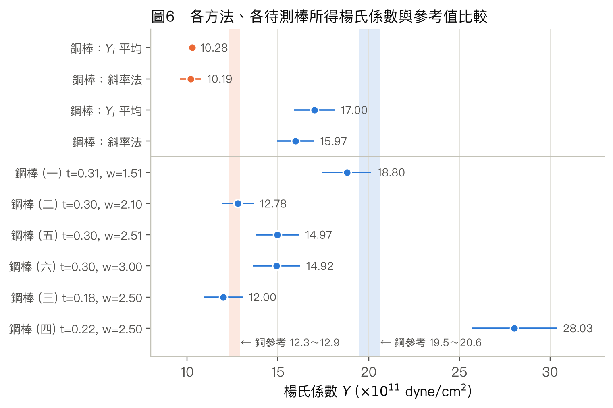

---
puppeteer:
  format: "A4"
  
  displayHeaderFooter: true
  headerTemplate: ' '
  footerTemplate: >
    

       / 
    

id: "test"
---

<!DOCTYPE html>
<html>
<head>
<meta charset="UTF-8">
<link rel="stylesheet" href="https://cdn.jsdelivr.net/npm/katex@0.16.9/dist/katex.min.css">

</head>
<body>
</body>
</html>

  

    普通物理學實驗
  

  

    楊氏係數測定
  

  

    組別：第4組
  

  

    組員： 
     
    4115064201 洪秉寬 
    4115064213 胡庭睿 
  

  

## 實驗目的

實際操作後，我們替這個實驗訂下四個學習目標：

1. 理解如何把看不見的位移放大來測量。金屬棒加上 1 kg 砝碼後，中點只下降約 1.8 mm，肉眼幾乎無法精確判讀。光槓桿把這個位移放大 $2d/a = 125$ 倍，變成約 22.6 cm 的米尺刻度變化。我想知道放大倍率由哪些幾何量決定，以及放大的代價：誤差也跟著被放大。
2. 由彎曲量求出材料常數。利用橫樑彎曲公式與光槓桿測量銅棒與鋼棒的楊氏係數 $Y$，並以加重與減重平均、差值法與最小平方法處理數據，檢驗負載與形變是否符合虎克定律的線性關係。
3. 驗證幾何形狀對彎曲的影響。固定負載與材料，只改變棒寬 $w$ 或棒厚 $t$，用雙對數圖求出 $\Delta h \propto w^{\beta}$、$\Delta h\propto t^{\beta}$ 的指數，檢驗理論的 $\beta_w=-1$、$\beta_t=-3$，並藉此理解工字樑、鐵軌截面的設計原理。
4. 學會評估一個測量方法的可信度。以誤差傳遞找出主導誤差（本實驗為 $t^3$ 項），比較實驗值與文獻值的差距是否超出隨機誤差；若超出，就追查系統誤差的來源並提出改進方案。

## 實驗原理

### 1. 應力、應變與楊氏係數

彈性體受一對大小相等、方向相反的力 $F$ 作用時會產生形變。應力（stress）定義為單位面積所受的力，應變（strain）定義為長度的相對變化量。在彈性限度內兩者成正比：

$$\frac{F}{A}=Y\cdot\frac{\Delta L}{L}\tag{1}$$

| 符號 | 意義 | 單位（cgs） |
|:---:|:---|:---:|
| $F$ | 垂直作用於截面的力 | dyne |
| $A$ | 受力截面積 | cm² |
| $L$ | 物體原長 | cm |
| $\Delta L$ | 沿受力方向的長度變化量 | cm |
| $Y$ | 楊氏係數，只與材料本身有關 | dyne/cm² |

### 2. 受力橫樑的彎曲

把橫樑架在相距 $L$ 的兩個刀口上，在中點施加鉛直力 $G$，橫樑就會往下彎。彎曲時樑的上半部被壓短、下半部被拉長，中間會有一層長度不變，叫做中性層。

推導時，取距離支點 $x$（$x<L/2$）、長度 $\mathrm{d}x$ 的一小段來分析：

(1) 這一小段中，距中性層 $y$ 的薄層應變為 $y/\rho$，其中 $\rho$ 是該處的曲率半徑。代入式 (1)，這層的應力為 $Yy/\rho$。

(2) 把每一薄層的彈性力對中性層取力矩再加總，得到內力矩：

$$\int_{-t/2}^{t/2} y\cdot\frac{Yy}{\rho}\,w\,\mathrm{d}y=\frac{Y}{\rho}\cdot\frac{wt^3}{12}=\frac{YI}{\rho},\qquad I\equiv\frac{wt^3}{12}$$

(3) 內力矩要和支點反力 $G/2$ 產生的外力矩 $Gx/2$ 平衡，所以這一小段的彎折角為 $\mathrm{d}\varphi=\mathrm{d}x/\rho = \dfrac{Gx}{2YI}\mathrm{d}x$。

(4) 這一小段的彎折會讓中點下降 $\mathrm{d}H = x\,\mathrm{d}\varphi$。從支點積分到中點：

$$H=\int_0^{L/2}\frac{Gx^2}{2YI}\,\mathrm{d}x=\frac{GL^3}{48\,YI}=\frac14\left(\frac{L}{t}\right)^3\frac{1}{w}\cdot\frac{G}{Y}\tag{2}$$

這個結果和講義附錄用平板彈簧模型推出來的相同，也和材料力學中簡支樑中央受集中力的撓度公式 $\delta = PL^3/48EI$ 一致。

| 符號 | 意義 |
|:---:|:---|
| $H$ | 橫樑中點的下降量（彎曲程度） |
| $G$ | 作用於中點的鉛直力，$G=Mg$ |
| $L$ | 兩刀口間的距離 |
| $w,\ t$ | 橫樑的寬度與厚度（$t$ 沿受力方向） |
| $I$ | 截面二次矩（面積慣性矩），矩形截面 $I=wt^3/12$ |
| $\rho,\ \varphi$ | 局部曲率半徑、彎折角 |

從式 (2) 可以看出 $H\propto w^{-1}$、$H\propto t^{-3}$、$H\propto L^3$。其中厚度的影響最大，是三次方。原因是離中性層越遠的材料應變越大，力臂也越長，兩者相乘再積分，就得到 $\int y^2\,\mathrm{d}y\propto t^3$。

### 3. 光槓桿的放大原理

光槓桿是一面裝在三足架上的平面鏡。兩隻前足放在固定的支撐條上，後足放在待測棒的中點。當棒的中點下降 $H$，鏡面就會往後傾 $\theta$ 角。

根據反射定律，鏡面轉 $\theta$ 時法線也跟著轉 $\theta$，入射角和反射角各改變 $\theta$，所以反射光一共轉了 $2\theta$。從望遠鏡看距離 $d$ 處的米尺，讀到的刻度會移動 $h$：

$$\frac{H}{a}=\sin\theta\approx\theta,\qquad \frac{h}{d}=\tan2\theta\approx2\theta\quad\Longrightarrow\quad H=\frac{ah}{2d}\tag{3}$$

| 符號 | 意義 |
|:---:|:---|
| $a$ | 光槓桿後足到兩前足連線的垂直距離 |
| $d$ | 鏡面到米尺的距離 |
| $h$ | 望遠鏡中米尺刻度的移動量 |
| $\theta$ | 鏡面轉角 |

放大倍率為 $h/H = 2d/a$。本實驗 $d=150$ cm、$a=2.4$ cm，代入得放大倍率為 125 倍。

### 4. 楊氏係數的計算式與數據處理公式

#### 4-1 基本公式

把式 (3) 代入式 (2)，並令 $G=Mg$，得到：

$$Y=\frac{MgL^3d}{2wt^3ah}\tag{4}$$

#### 4-2 差值法

實際計算時，$M$ 和 $h$ 都取相對於無負荷狀態的差值（理由見實驗方法第 4 點）。本報告用兩種方式取差值：

$$\Delta h_i=\bar h_i-\bar h_0,\qquad Y_i=\frac{M_i\,gL^3d}{2wt^3a\,\Delta h_i}\qquad(\text{累積差，紀錄表})\tag{5}$$

$$\Delta\bar h_{i+1}=\bar h_{i+1}-\bar h_i,\qquad Y_i'=\frac{\Delta M\,gL^3d}{2wt^3a\,\Delta\bar h_{i+1}},\ \ \Delta M=200\ \text{g}\qquad(\text{相鄰差，步驟 6})\tag{6}$$

#### 4-3 線性迴歸

由式 (4)，$\Delta h$ 應與 $M$ 成正比。把所有數據用最小平方法擬合成 $\Delta h_i = kM_i+b$，再由斜率 $k$ 求出：

$$Y=\frac{gL^3d}{2wt^3a\,k}\tag{7}$$

#### 4-4 雙對數圖（第三部分）

第三部分固定 $M$，只改變 $w$ 或 $t$。把 $\Delta h=\alpha x^{\beta}$ 取對數，得到 $\ln\Delta h=\ln\alpha+\beta\ln x$，所以雙對數圖的斜率就是 $\beta$。理論預測為：

$$\beta_w=-1,\qquad \beta_t=-3\tag{8}$$

#### 4-5 誤差傳遞

由式 (7)，各量的誤差傳遞到 $Y$ 的相對不確定度為：

$$\left(\frac{\delta Y}{Y}\right)^2=\left(3\frac{\delta L}{L}\right)^2+\left(\frac{\delta d}{d}\right)^2+\left(\frac{\delta w}{w}\right)^2+\left(3\frac{\delta t}{t}\right)^2+\left(\frac{\delta a}{a}\right)^2+\left(\frac{\delta k}{k}\right)^2\tag{9}$$

### 5. 理論模型的假設條件

上面的推導用到以下假設：

1. 小形變：$H\ll L$，且 $\sin\theta\approx\theta$、$\tan2\theta\approx2\theta$。本實驗 $H_{\max}\approx0.18$ cm，只有 $L$ 的 0.5%。
2. 線彈性：負載在彈性限度內，應力和應變成正比，卸載後能完全恢復。
3. 材料均勻且等向：拉伸和壓縮的 $Y$ 相同，所以中性層剛好在幾何中心。
4. 截面均勻：$w$、$t$ 沿棒長不變，截面是理想的矩形。
5. 平截面假設（Euler-Bernoulli）：截面彎曲後仍是平面，且垂直於中性層。另外忽略剪切形變（$L/t\approx115$，剪切修正約 $10^{-4}$ 量級）。
6. 理想簡支：刀口沒有摩擦力矩，也不會下陷；力 $G$ 剛好作用在中點，光槓桿後足也剛好在中點。
7. 忽略棒的自重與初始彎曲，這兩項可以用差值法消去。
8. 忽略蒲松效應造成的橫向反向彎曲（寬度方向上的曲面效應）。

## 實驗方法

1. 以彎曲取代拉伸來放大形變。若把同一支銅棒（截面 $0.615\ \text{cm}^2$）直接拉伸 1 kg，伸長量只有 $\Delta L=FL/(AY)\approx4\times10^{-5}$ cm（約 0.4 μm）。改成三點彎曲後，中點下降約 0.18 cm，約為前者的 4000 倍，這來自式 (2) 的幾何因子 $(L/t)^3$。
2. 用光槓桿把位移轉換為角度，再放大為刻度變化。讀取形變時不必接觸待測物，放大倍率 $2d/a=125$ 只由容易量測的長度 $d$、$a$ 決定，而且在小角度下保持線性。
3. 加重與減重各讀一次再平均，可以抵銷遲滯、刀口摩擦、潛變這類與負載方向有關的誤差。兩次讀數的差也能用來檢查是否超過彈性限度。
4. 使用差值 $\Delta h$、$\Delta M$ 計算。米尺零點、勾盤重量、棒的自重與初始彎曲都會在相減時消去，剩下的只有每增加一份重量棒子多彎多少。
5. 多點負載加上線性迴歸。用 6 個負載點的斜率求 $Y$，可以利用全部數據、平均掉隨機誤差，並以截距 $b$ 吸收系統性的零點偏移；$R^2$ 則直接檢驗虎克定律。
6. 控制變因。第三部分固定材料、$M$、$L$、$a$、$d$，只改變 $w$ 或 $t$，以雙對數圖驗證式 (2) 的尺度律。
7. 兩種材料用相同裝置與幾何量測量。$a$、$d$、$L$ 等共用的系統誤差會在 $Y_{\text{鋼}}/Y_{\text{銅}}$ 的比值中相消，可以用來診斷誤差來源。

## 數據分析

以下取 $g=980\ \text{cm/s}^2$，米尺讀數 $h$ 的單位為 cm。

### 一、共同參數與測量不確定度

| 物理量 | 數值 | 測量工具 | 估計不確定度 $\delta$ | 在式 (7) 中的次方 | 對 $Y$ 的相對貢獻 |
|:---|:---:|:---:|:---:|:---:|:---:|
| 光槓桿足距 $a$ | 2.4 cm | 米尺（量紙上足印） | 0.05 cm | 1 | 2.08% |
| 鏡面至米尺距離 $d$ | 150 cm | 捲尺 | 1 cm | 1 | 0.67% |
| 兩刀口距離 $L$ | 34.6 cm | 米尺 | 0.1 cm | 3 | 0.87% |
| 棒寬 $w$ | 2.05 cm（銅）、2.1 cm（鋼） | 游標尺 | 0.005 cm | 1 | 0.24% |
| 棒厚 $t$ | 0.30 cm | 游標尺 | 0.005 cm | **3** | **5.00%** |
| 米尺讀數 $h$ | - | 望遠鏡 | 0.1 cm | 1 | 反映在斜率誤差 |

棒厚 $t$ 是最主要的誤差來源。它在分母上是三次方，0.05 mm 的讀數誤差就會造成 5% 的 $Y$ 誤差，其餘各項合計約 2.4%。

### 二、銅棒（$w=2.05$ cm，$t=0.30$ cm）

**表 1　銅棒數據（加重、減重讀數與楊氏係數）**

| 次數 $i$ | 槽碼 $M_i$ (g) | 加重讀數 $h_i$ | 減重讀數 $h_i'$ | 平均 $\bar h_i$ | 總變化量 $\Delta h_i=\bar h_i-\bar h_0$ | $Y_i$ ($\times10^{11}$ dyne/cm²) |
|:---:|:---:|:---:|:---:|:---:|:---:|:---:|
| 0 | 0 | 2.0 | 1.8 | 1.90 | 0 | - |
| 1 | 200 | 6.4 | 6.2 | 6.30 | 4.40 | 10.42 |
| 2 | 400 | 10.9 | 10.8 | 10.85 | 8.95 | 10.24 |
| 3 | 600 | 15.3 | 15.2 | 15.25 | 13.35 | 10.30 |
| 4 | 800 | 19.8 | 19.7 | 19.75 | 17.85 | 10.27 |
| 5 | 1000 | 24.4 | 24.5 | 24.45 | 22.55 | 10.16 |

楊氏係數平均值 $\bar Y_{\text{銅}}=(1.028\pm0.009)\times10^{12}\ \text{dyne/cm}^2$。誤差取 5 點的標準差 $0.09\times10^{11}$，只代表讀數的隨機散布，儀器誤差見第七節。

> 標準差計算算式

趨勢線（圖 1）為 $\Delta h=(0.02250\pm0.00011)\,M-(0.067\pm0.066)$，$R^2=0.99991$。代入式 (7)：

$$Y_{\text{銅}}=\frac{980\times34.6^3\times150}{2\times2.05\times0.30^3\times2.4\times0.02250}=1.019\times10^{12}\ \text{dyne/cm}^2$$

加重與減重讀數最多只差 0.2 cm（平均 0.13 cm），減重讀數也沒有系統性偏大，表示棒沒有發生永久形變，負載在彈性限度內。

### 三、鋼棒（$w=2.1$ cm，$t=0.30$ cm）

**表 2　鋼棒數據（加重、減重讀數與楊氏係數）**

| 次數 $i$ | 槽碼 $M_i$ (g) | 加重讀數 $h_i$ | 減重讀數 $h_i'$ | 平均 $\bar h_i$ | 總變化量 $\Delta h_i=\bar h_i-\bar h_0$ | $Y_i$ ($\times10^{11}$ dyne/cm²) |
|:---:|:---:|:---:|:---:|:---:|:---:|:---:|
| 0 | 0 | 23.0 | 23.3 | 23.15 | 0 | - |
| 1 | 200 | 25.5 | 26.0 | 25.75 | 2.60 | 17.21 |
| 2 | 400 | 28.0 | 27.8 | 27.90 | 4.75 | 18.84 |
| 3 | 600 | 31.1 | 31.3 | 31.20 | 8.05 | 16.68 |
| 4 | 800 | 34.3 | 34.2 | 34.25 | 11.10 | 16.13 |
| 5 | 1000 | 37.0 | 37.0 | 37.00 | 13.85 | 16.15 |

楊氏係數平均值 $\bar Y_{\text{鋼}}=(1.700\pm0.112)\times10^{12}\ \text{dyne/cm}^2$，誤差取 5 點的標準差。

趨勢線（圖 1）為 $\Delta h=(0.01401\pm0.00041)\,M-(0.279\pm0.246)$，$R^2=0.99663$。代入式 (7)：

$$Y_{\text{鋼}}=\frac{980\times34.6^3\times150}{2\times2.1\times0.30^3\times2.4\times0.01401}=1.597\times10^{12}\ \text{dyne/cm}^2$$

鋼棒較硬，每 200 g 只移動約 2.8 cm，比銅棒的 4.5 cm 小，讀數誤差所佔的比例因此較大。加重與減重的讀數差最大到 0.5 cm（平均 0.22 cm），所以 $Y_i$ 的散布（標準差 6.6%）明顯大於銅棒（0.9%）。

### 四、作圖分析

<figure class="image-block">
  

  <figcaption>圖 1：兩棒的總變化量 Δhi 對槽碼質量 Mi，實線為最小平方趨勢線。誤差棒 ±0.1 cm，比符號還小。</figcaption>
</figure>

圖 1 畫的是 $\Delta h_i$ 對 $M_i$。兩組數據都非常接近直線，$R^2$ 分別為 0.99991 與 0.99663，證實在 0～1000 g 範圍內彎曲量與負載成正比，虎克定律成立。兩條趨勢線的截距都略小於零（銅 −0.07 cm、鋼 −0.28 cm）；鋼的截距約為其標準誤差的 1.1 倍，差異不顯著。可能的原因是加上第一個砝碼時，棒與刀口、光槓桿足尖之間還在就位，使前幾點的形變略偏小。斜率法用截距吸收這個偏移，因此比逐點計算的 $Y_i$ 可靠。

<figure class="image-block">
  

  <figcaption>圖 2：每增加 200 g 時讀數的變化 Δh̄i+1。虛線為平均值，誤差棒 ±0.14 cm（兩次讀數誤差的合成）。</figcaption>
</figure>

圖 2 畫的是 $\Delta\bar h_{i+1}$ 對 $M_{i+1}$，也就是局部斜率：每多掛 200 g 棒子多彎多少。對線彈性材料，它應該是一條水平線。

- 銅棒落在 4.40～4.70 cm 之間（平均 $4.51\pm0.12$ cm），起伏與讀數誤差 ±0.14 cm 相當，是很好的水平線。
- 鋼棒落在 2.15～3.30 cm 之間（平均 $2.77\pm0.44$ cm），起伏約為讀數誤差的 3 倍，但沒有隨 $M$ 單調增加或減少。因此這些偏差屬於隨機誤差，例如光槓桿足尖微滑、桌面振動、砝碼還在晃動就讀數，而不是材料進入非線性區。

<figure class="image-block">
  

  <figcaption>圖 3：由式 (5) 逐點計算的 Yi 對 Mi。色帶為講義附表的參考範圍，誤差棒只含 Δh 的讀數誤差 ±0.1 cm。</figcaption>
</figure>

圖 3 畫的是 $Y_i$ 對 $M_i$。楊氏係數是材料常數，理論上應為與負載無關的水平線。

- 銅棒的 $Y_i$ 在 ±1.3% 內保持水平，但有極輕微的下降趨勢（10.42 → 10.16）。原因有二：(1) 負截距使小負載時的 $Y_i$ 偏高約 1.5%；(2) 小角度近似 $\tan2\theta\approx2\theta$ 在大負載時會高估 $H$。以精確幾何 $H=a\sin[\tfrac12\tan^{-1}(\Delta h/d)]$ 重算後，1000 g 時的 $Y$ 修正 +0.8%，下降趨勢從 −2.4% 減為 −1.6%。
- 鋼棒前兩點偏高（17.21、18.84），600 g 以後穩定在 16.1～16.7，同樣是負截距（初始就位）的效果。
- 兩種材料的 $Y_i$ 都明顯低於參考色帶，原因在討論中追查。

### 五、不同計算方式的比較

為了確認計算方式對結果的影響，把同一組數據用六種方式計算 $Y$：

**表 3　相鄰差（步驟 6）的逐步計算**

| 區間 | $M_{i+1}$ (g) | 銅 $\Delta\bar h_{i+1}$ (cm) | 銅 $Y_i'$ ($\times10^{11}$) | 鋼 $\Delta\bar h_{i+1}$ (cm) | 鋼 $Y_i'$ ($\times10^{11}$) |
|:---:|:---:|:---:|:---:|:---:|:---:|
| 0→1 | 200 | 4.40 | 10.42 | 2.60 | 17.21 |
| 1→2 | 400 | 4.55 | 10.07 | 2.15 | 20.81 |
| 2→3 | 600 | 4.40 | 10.42 | 3.30 | 13.56 |
| 3→4 | 800 | 4.50 | 10.19 | 3.05 | 14.67 |
| 4→5 | 1000 | 4.70 | 9.75 | 2.75 | 16.27 |
| 平均 ± 標準差 | | $4.51\pm0.12$ | $10.17\pm0.28$ | $2.77\pm0.44$ | $16.50\pm2.79$ |

**表 4　六種計算方式的比較（單位 $\times10^{11}$ dyne/cm²）**

| 方法 | 銅棒 | 鋼棒 | 說明 |
|:---|:---:|:---:|:---|
| (A) 累積差 $\Delta h_i$、$M_i$ 逐點後平均（式 5） | $10.28\pm0.09$ | $17.00\pm1.12$ | 各點共用 $\bar h_0$，誤差彼此相關 |
| (B) 相鄰差 $\Delta\bar h_{i+1}$、$\Delta M$ 後平均（式 6） | $10.17\pm0.28$ | $16.50\pm2.79$ | 每步只有 200 g，相對讀數誤差最大 |
| (C) 逐差法 $(\bar h_{i+3}-\bar h_i)$，$\Delta M=600$ g | 10.21 | 15.70 | 每筆數據只用一次，差距大 |
| **(D) 最小平方斜率（含截距，式 7）** | $\mathbf{10.19\pm0.05}$ | $\mathbf{15.97\pm0.46}$ | 用全部數據，截距吸收零點偏移 |
| (E) 過原點斜率 | 10.23 | 16.42 | 強迫截距為零，受初始就位影響 |
| (F) 直接用讀數 $\bar h_i$（不扣 $\bar h_0$） | 7.28 → 9.37 | 1.74 → 6.05 | 隨 $M$ 改變，無物理意義 |

表中誤差：(A)、(B) 為標準差，(D) 為斜率的統計標準誤。

- 方法 (B) 的平均值會伸縮相消：$\frac15\sum(\bar h_{i+1}-\bar h_i)=(\bar h_5-\bar h_0)/5$，中間 4 筆數據完全沒有用到，等於只用頭尾兩點算一次。逐差法 (C) 與迴歸法 (D) 就是為了改善這一點。
- 方法 (F) 把米尺的任意零點當成形變。銅棒 $\bar h_0=1.90$ cm，誤差較小；鋼棒 $\bar h_0=23.15$ cm，結果偏小到 1/10。所以一定要用差值計算。
- 最終結果採用 (D) 斜率法。

### 六、鋼棒形變與寬度、厚度的關係（$M=200$ g，$a=2.4$ cm，$d=150$ cm，$L=34.6$ cm）

表中 $h_0$ 沒有另外記錄，是由 $h_i-\Delta h_i$ 反推。預測 $\Delta h$ 一欄是把第二部分鋼棒的斜率法結果 $Y=15.97\times10^{11}$ 代入式 (4) 算出，用來檢查各棒是否一致。

**表 5　不同寬度的鋼棒**

| 棒號 | 棒厚 $t$ (cm) | 棒寬 $w$ (cm) | 讀數 $h_i$ | 反推 $h_0$ | $\Delta h_i$ (cm) | $Y_i$ ($\times10^{11}$) | 預測 $\Delta h$ | 實測／預測 |
|:---:|:---:|:---:|:---:|:---:|:---:|:---:|:---:|:---:|
| (一) | 0.31 | 1.51 | 21 | 18.0 | 3.0 | 18.80 | 3.53 | 0.85 |
| (二) | 0.30 | 2.1 | 25.5 | 22.0 | 3.5 | 12.78 | 2.80 | 1.25 |
| (五) | 0.30 | 2.51 | 21.5 | 19.0 | 2.5 | 14.97 | 2.34 | 1.07 |
| (六) | 0.30 | 3.0 | 21.1 | 19.0 | 2.1 | 14.92 | 1.96 | 1.07 |

**表 6　不同厚度的鋼棒**

| 棒號 | 棒寬 $w$ (cm) | 棒厚 $t$ (cm) | 讀數 $h_i$ | 反推 $h_0$ | $\Delta h_i$ (cm) | $Y_i$ ($\times10^{11}$) | 預測 $\Delta h$ | 實測／預測 |
|:---:|:---:|:---:|:---:|:---:|:---:|:---:|:---:|:---:|
| (三) | 2.5 | 0.18 | 64.5 | 50.0 | 14.5 | 12.00 | 10.89 | 1.33 |
| (四) | 2.5 | 0.22 | 29.7 | 26.3 | 3.4 | 28.03 | 5.97 | **0.57** |
| (五) | 2.51 | 0.30 | 21.5 | 19.0 | 2.5 | 14.97 | 2.34 | 1.07 |

<figure class="image-block">
  

  <figcaption>圖 4：Δhi 對棒寬 w 的關係。藍線為乘冪擬合，灰色虛線為理論 β = −1，並通過數據的幾何平均點。</figcaption>
</figure>

寬度指數：以 4 點作 $\ln\Delta h$ 對 $\ln w$ 的最小平方擬合，得

$$\Delta h = 4.20\,w^{-0.54\pm0.37},\qquad \beta_w=-0.54\ \xrightarrow{\ \text{取最接近整數}\ }\ \boxed{\beta_w=-1}$$

擬合的 $R^2$ 只有 0.52，數據相當分散，因此再做兩項檢驗：

- 棒 (一) 的厚度是 0.31 cm 而非 0.30 cm。以 $(t/0.30)^3$ 把它校正到同厚度後，得 $\beta_w=-0.69\pm0.31$。
- 棒 (二) 的尺寸與第二部分的鋼棒相同（$w=2.1$、$t=0.30$ cm）。第二部分同樣掛 200 g 時 $\Delta h=2.60$ cm，這裡卻讀到 3.5 cm，相差 35%，可見單次讀數的重現性只有約 ±0.5 cm。若改用第二部分較可靠的 2.60 cm（加重與減重的平均），並做厚度校正，得 $\beta_w=-0.63\pm0.08$（$R^2=0.97$）。

三種處理的 $\beta_w$ 都落在 −0.5～−0.7 之間，取整數為 −1，方向與理論一致：棒越寬越不易彎。不過實測的相依性比理論弱，原因見討論。

<figure class="image-block">
  

  <figcaption>圖 5：Δhi 對棒厚 t 的關係。藍線為乘冪擬合，灰色虛線為理論 β = −3；空心點 (四) 偏離預測達 43%。</figcaption>
</figure>

厚度指數：以 3 點擬合，得

$$\Delta h = 0.0420\,t^{-3.23\pm1.69},\qquad \beta_t=-3.23\ \xrightarrow{\ \text{取最接近整數}\ }\ \boxed{\beta_t=-3}$$

結果與理論 $\beta_t=-3$ 相差 8%。厚度只從 0.30 cm 減到 0.18 cm（0.6 倍），形變就增加到 5.8 倍，與 $0.6^{-3}=4.6$ 同一數量級，三次方的效應很明顯。

擬合誤差 ±1.69 很大，主要來自棒 (四)。它的 $\Delta h=3.4$ cm 只有預測值 5.97 cm 的 57%，算出的 $Y=2.80\times10^{12}$ 也超過一般鋼材可能的上限（約 $2.1\times10^{12}$），應視為離群值。若只用 (三)、(五) 兩點，得 $\beta_t=-3.44$，取整數仍是 −3。

<figure class="image-block">
  

  <figcaption>圖 6：所有楊氏係數結果與參考範圍的比較。斜率法的誤差棒為式 (9) 的總不確定度；第三部分各棒的誤差棒含讀數、t、a、L、d 的誤差。</figcaption>
</figure>

$Y$ 是材料常數，理論上不應隨 $w$、$t$ 改變。第三部分各棒的結果如下：

- 寬度組的 $Y$ 為 18.80、12.78、14.97、14.92（平均 $15.4\pm2.5$），沒有隨 $w$ 單調變化的趨勢。
- 厚度組排除 (四) 後為 12.00 與 14.97。

各棒之間約 ±16% 的差異，大於第二部分多點測量的精確度。這個差異來自單次 200 g 讀數的誤差，以及各棒 $t$ 的量測誤差（經 $t^3$ 放大），不代表 $Y$ 與形狀有關。

### 七、誤差傳遞與最終結果

**表 7　最終結果（斜率法）**

| 項目 | 銅棒 | 鋼棒 |
|:---|:---:|:---:|
| 斜率 $k$ (cm/g) | $0.02250\pm0.00011$ | $0.01401\pm0.00041$ |
| 斜率統計誤差 $\delta k/k$ | 0.48% | 2.91% |
| 儀器誤差合成（$a,d,L,w,t$） | 5.53% | 5.53% |
| 總相對不確定度，式 (9) | 5.55% | 6.25% |
| **$Y$ ($\times10^{12}$ dyne/cm²)** | $\mathbf{1.02\pm0.06}$ | $\mathbf{1.60\pm0.10}$ |
| $Y$ (GPa) | $102\pm6$ | $160\pm10$ |
| 講義參考值 ($\times10^{12}$ dyne/cm²) | 1.23～1.29 | 1.95～2.06 |
| 相對誤差（對參考範圍中值） | −19.2% | −20.3% |
| 與參考下限的差距 | 3.7 σ | 3.5 σ |
| 實驗值／參考中值 | 0.808 | 0.797 |

## 結果與討論

### 一、實驗結果與理論是否吻合（a）

1. 虎克定律（線性）吻合。兩棒的 $\Delta h$ 對 $M$ 圖 $R^2>0.996$。銅棒的相鄰差 $\Delta\bar h_{i+1}$ 起伏在讀數誤差內；加重與減重讀數差 ≤ 0.5 cm，也沒有殘餘形變。整個實驗都在彈性限度內，符合式 (2) 的前提。
2. 尺度律吻合。厚度指數 $\beta_t=-3.23$，與理論 −3 相差 8%。寬度指數 $\beta_w=-0.54$～$-0.69$，取整數為 −1，方向正確，但數值偏離較大，原因在第三節說明。
3. 楊氏係數的絕對值不吻合，系統性偏低約 20%。銅為 $(1.02\pm0.06)\times10^{12}$，鋼為 $(1.60\pm0.10)\times10^{12}$ dyne/cm²，都比講義參考值低，差距超過估計不確定度的 3.5 倍。隨機誤差無法解釋這麼大的差距，一定有未被考慮的系統誤差。
4. 兩材料的比值非常吻合。$Y_{\text{鋼}}/Y_{\text{銅}}=15.97/10.19=1.568$；以講義附表的中值計算，參考比值為 $20.05/12.6=1.591$，只差 1.5%，也落在參考範圍所允許的比值 1.51～1.67 之間。所以本實驗能準確分辨兩種材料的相對硬度，偏差只出在兩者共同的一個比例因子上。

### 二、為何系統性偏低？（b）

兩棒的實驗值與參考值之比幾乎相同（0.808 與 0.797），最合理的解釋是誤差來自兩次測量共用的量，這類量會在比值中相消。兩次測量的 $a$、$d$、$L$ 完全相同，$t$ 也都記錄為 0.30 cm。若要讓 $Y$ 回到參考值（乘上約 1.25），各量需要的修正如下：

| 可能來源 | 在 $Y$ 中的相依 | 要讓 $Y\times1.25$ 所需的真值 | 需要的誤差 | 可能性 |
|:---|:---:|:---:|:---:|:---|
| 棒厚 $t$ | $t^{-3}$ | 0.279 cm（紀錄 0.30） | −0.021 cm | 高。只要差 0.2 mm。記錄的 0.3 cm 可能經過四捨五入，或量在邊緣毛邊、較厚處；棒中段若略薄也會如此 |
| 足距 $a$ | $a^{-1}$ | 1.93 cm（紀錄 2.4） | −0.47 cm | 中。若量的是後足到某一前足的斜距，而不是講義要求的到兩前足連線的垂直距離，當兩前足相距約 2.9 cm 時，斜距恰為 $\sqrt{1.93^2+1.45^2}\approx2.4$ cm |
| 鏡尺距離 $d$ | $d^{1}$ | 187 cm（紀錄 150） | +37 cm | 低，誤差太大 |
| 刀口距離 $L$ | $L^{3}$ | 37.2 cm（紀錄 34.6） | +2.6 cm | 低，米尺不太可能差這麼多 |

我認為最可能的原因是棒厚 $t$ 量得偏大（$t^3$ 使 0.2 mm 的誤差放大成 20%），其次是光槓桿足距 $a$ 量成了斜距。這兩者都會以相同比例同時壓低兩棒的 $Y$，與比值吻合的結果一致。若能重做，應以螺旋測微器在棒的中段多點量 $t$，並在足印紙上用三角板作垂線量 $a$。

另一個可能是材料本身。講義的銅參考值 12.3～12.9 是純銅的數值，但銅的 $Y$ 會隨純度與加工狀態明顯變化，文獻常見範圍約 110～130 GPa，Callister 的表列值為 110 GPa。我們的銅棒結果 $1.02\times10^{12}$ 恰好落在講義黃銅範圍（0.97～1.02）的上緣；若這支棒其實是黃銅，銅的結果就是正確的。不過這無法解釋鋼棒同樣偏低 20%，而兩者比值吻合又支持共同因子的解釋，所以材料因素最多只是次要原因。量測棒的密度就能分辨：純銅 8.96 g/cm³，黃銅約 8.4～8.7 g/cm³。

### 三、影響實驗結果的誤差因素（c）

1. 棒厚 $t$（主導）：見上節。薄棒更嚴重，例如 (三) $t=0.18$ cm 時，0.005 cm 的誤差就造成 8.3% 的 $Y$ 誤差。棒厚不均勻、邊緣毛邊也會影響。
2. 足距 $a$：在紙上壓足印再用米尺量，精度只有約 0.5 mm，造成 2% 的誤差；若量成斜距則是系統誤差。
3. 米尺讀數 $h$：望遠鏡的視差、對焦不清與十字線粗細，使讀數精度約 ±0.1 cm。鋼棒每步只移動 2.8 cm，單步相對誤差就有 3.6%。實際的起伏（±0.44 cm）比讀數精度還大，表示另有其他擾動，例如光槓桿足尖微滑、實驗桌振動、砝碼吊盤還在擺動就讀數。
4. 初始就位（負截距）：剛加第一個砝碼時，棒與刀口、足尖與棒面之間的接觸還在調整，使前幾點的形變偏小，所以鋼棒小負載的 $Y_i$ 偏高（18.84）。斜率法可以消除這個效應。
5. 遲滯與潛變：加重與減重的讀數差平均為 0.13 cm（銅）與 0.22 cm（鋼）。取平均可以抵銷，但若每次等待的時間不同，仍會殘留誤差。
6. 小角度近似：銅棒在 1000 g 時 $\Delta h/d=0.15$，$\tan2\theta\approx2\theta$ 使 $Y$ 低估 0.8%。影響不大，但可以解釋 $Y_i$ 隨負載微降的趨勢。
7. 負載與足尖不在中點：若後足偏離中點 1 cm，該點的撓度只有中點的 99.5%，會使 $Y$ 偏高 0.5%。影響很小，方向也與觀察到的偏低相反，所以不是主因。
8. 支撐系統的變形：若刀口或支架在負載下微量下沉，量到的 $H$ 會多出這一部分，使 $Y$ 偏低。這一項難以估計，也可能是系統誤差的一部分。
9. 第三部分的特有問題：每支棒只量一次 200 g，沒有加重與減重平均；換棒時要重新放置光槓桿，後足的位置每次都不同。棒 (二) 在第二、第三部分的 200 g 讀數差到 0.9 cm，可見重現性不佳，這也是 $\beta_w$ 偏離 −1 的主因。棒 (四) 偏離 43%，推測是讀數或紀錄錯誤，或後足沒有放在棒的中線上，需要重測才能確認。

### 四、可替代或更精準的實驗方法（d）

1. 以螺旋測微器量 $t$：精度 0.001 cm，可使 $t$ 項誤差從 5% 降到約 1%。這是成本最低、效果最大的改進。
2. 直接量中點撓度：在棒中點下方放置千分表（0.001 mm 級），或使用 LVDT、電容式位移感測器，就不需要光槓桿，也省去 $a$、$d$ 與讀數的誤差。
3. 雷射取代望遠鏡：用雷射筆照射光槓桿鏡面，在遠處以方格紙或 CCD、手機相機記錄光點位置。這樣可以把 $d$ 拉長到 3～5 m 以提高放大倍率，並用影像分析取代肉眼讀數。
4. 應變規（strain gauge）：貼在棒的下表面直接量表面應變 $\varepsilon=3Gx/(Ywt^2)$（$x$ 為距支點的距離），同樣可以求出 $Y$，而且對 $t$ 的相依降為平方。
5. 拉伸試驗：以萬能試驗機加伸長計（extensometer）量應力對應變的曲線，或以 Searle 法測細金屬線的伸長，直接對應 $Y$ 的定義式 (1)。
6. 動態共振法（脈衝激振法，ASTM E1876）：敲擊懸空的棒，以麥克風或手機 FFT 量測第一彎曲共振頻率。自由樑的 $f_1\approx1.028\,(t/L^2)\sqrt{Y/\rho}$，頻率可以量得極準（<0.1%），$Y\propto f^2$，只需另量密度與尺寸。工業上最常用這種非破壞量測法。
7. 超音波法：量測縱波在細棒中的傳播時間，由 $v=\sqrt{Y/\rho}$ 求得 $Y$。

### 五、延伸應用（e）

1. 原子力顯微鏡（AFM）用光槓桿偵測探針懸臂的微小彎曲，原理與本實驗相同（Meyer & Amer, 1988）：把雷射反射到位置感測器上，可以解析到次奈米的位移。
2. 精密角度量測：卡文狄希扭秤、鏡式檢流計都用鏡面反射把微小轉角放大讀出。
3. 結構工程中的截面設計：式 (2) 的 $H\propto1/(wt^3)$ 說明材料放在離中性層越遠的地方越有效率。工字樑、鐵軌的截面，以及木地板格柵要立著放，都是同樣的道理；本實驗的 $\beta_t=-3$ 就是直接的量化證據。
4. MEMS 與感測器：微懸臂樑加速度計、壓力感測器、質量感測器都是先讓力造成彎曲，再用光學或電學方法讀出彎曲量。
5. 材料鑑定與品質管制：楊氏係數可以用來辨識合金成分，或檢測材料內部的缺陷與熱處理狀態。

### 六、與文獻及其他實驗結果的比較（f）

| 來源 | 銅 ($\times10^{11}$ dyne/cm²) | 黃銅 | 鋼 |
|:---|:---:|:---:|:---:|
| 本實驗（斜率法） | $10.2\pm0.6$ | - | $16.0\pm1.0$ |
| 本實驗（紀錄表 $Y_i$ 平均） | 10.28 | - | 17.00 |
| 講義附表 | 12.3～12.9 | 9.7～10.2 | 19.5～20.6 |
| Callister, Table 6.1 | 11.0 | 9.7 | 20.7 |
| Halliday, Table 12-1 | - | - | 20.0 |

- 各文獻的鋼材數值都在 $2.0\times10^{12}$ 附近，本實驗低約 20%。
- 銅的文獻值範圍較寬（11.0～12.9）。與 Callister 的 11.0 相比，我們只低 7%；與講義的 12.6 相比則低 19%。可見銅的真值本身與材料狀態有關，比較時應註明所用的參考來源。

## 結論

1. 以光槓桿（放大倍率 125 倍）測量橫樑彎曲，並以最小平方斜率法求得：
   - 銅棒 $Y=(1.02\pm0.06)\times10^{12}$ dyne/cm²，即 $102\pm6$ GPa；
   - 鋼棒 $Y=(1.60\pm0.10)\times10^{12}$ dyne/cm²，即 $160\pm10$ GPa。
   
   紀錄表以 $Y_i$ 平均得 $1.028\times10^{12}$ 與 $1.700\times10^{12}$ dyne/cm²。
2. $\Delta h$ 與 $M$ 高度線性（$R^2$ = 0.99991、0.99663），加重與減重讀數一致，證實在 0～1000 g 範圍內兩棒都遵守虎克定律，沒有超過彈性限度。
3. 兩棒的 $Y$ 都比參考值低約 20%，但鋼與銅的比值 1.568 與參考值 1.591 只差 1.5%。這表示誤差來自兩次測量共用的系統因子，最可能是棒厚 $t$ 量得偏大（經 $t^3$ 放大），或光槓桿足距 $a$ 量成斜距。
4. 控制變因實驗得 $\Delta h\propto w^{-0.54}$ 與 $\Delta h\propto t^{-3.23}$，取最接近整數為 $\beta_w=-1$、$\beta_t=-3$，驗證了 $H\propto1/(wt^3)$。厚度的影響遠大於寬度，工字樑與鐵軌的截面就是依此設計。楊氏係數則與棒的寬度、厚度無關。
5. 本方法的精確度約 ±6%，主要受棒厚量測限制。改用螺旋測微器量 $t$、多點負載加迴歸，或改用動態共振法，都能明顯提高準確度。

## 參考資料

1. 普通物理實驗講義，〈實驗三　楊氏係數測定〉
2. D. Halliday, R. Resnick, J. Walker, *Fundamentals of Physics*, 10th ed. (John Wiley & Sons, Hoboken, NJ, 2014), Ch. 12 "Equilibrium and Elasticity" (pp. 327-342), Sec. 12-3 "Elasticity"（含 Table 12-1）.
3. J. M. Gere, B. J. Goodno, *Mechanics of Materials*, 8th ed. (Cengage Learning, Stamford, CT, 2013), Ch. 5 "Stresses in Beams (Basic Topics)"; Ch. 9 "Deflections of Beams".
4. W. D. Callister, Jr., D. G. Rethwisch, *Materials Science and Engineering: An Introduction*, 8th ed. (John Wiley & Sons, Hoboken, NJ, 2010), Ch. 6 "Mechanical Properties of Metals", Sec. 6.3, Table 6.1.
5. J. R. Taylor, *An Introduction to Error Analysis: The Study of Uncertainties in Physical Measurements*, 2nd ed. (University Science Books, Sausalito, CA, 1997), Ch. 3 "Propagation of Uncertainties", pp. 45-92; Ch. 8 "Least-Squares Fitting", pp. 181-207.
6. G. Meyer, N. M. Amer, "Novel optical approach to atomic force microscopy," *Applied Physics Letters*, **53**(12), 1045-1047 (1988).
7. ASTM E1876-15, *Standard Test Method for Dynamic Young's Modulus, Shear Modulus, and Poisson's Ratio by Impulse Excitation of Vibration* (ASTM International, West Conshohocken, PA, 2015).

## 工作分配

| 組員 | 學號 | 負責工作 |
|:---:|:---:|:---|
| 胡庭睿 | 4115064213 | |
| | | |
| | | |
